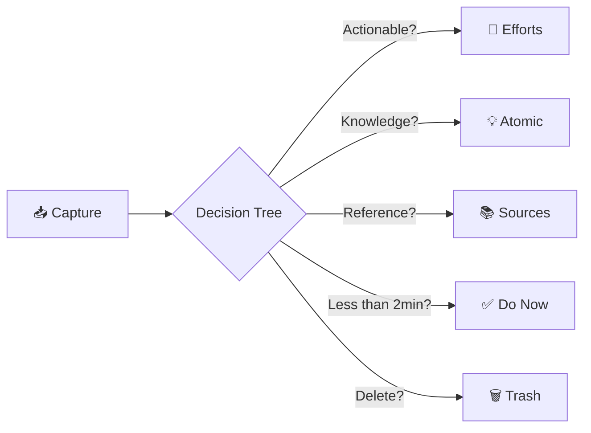

> [!orbit] Wayfinder | [[+Inbox]] | [[+About Knowledgeℹ️]] | [[+About Effortsℹ️]]

# 📋 Inbox Folder Contract

**What**: Raw captures awaiting triage—fleeting thoughts, voice memos, web clips, quick notes. Temporary holding space, not storage.

**When**: Capture anytime. Process daily (10 minutes). Clear within 24-48 hours.

**Where**: `+Inbox/` — temporary inbox folder at vault root.

**Lifecycle**: Create when capturing. Triage to Knowledge, Efforts, or Sources based on type. Delete or archive when processed.

**Frontmatter**: None by default, deliberately. `+Inbox` carries **no Templater folder template** — a note created directly here stays bare, so pasting a snippet or jotting a command costs nothing to clean up. Frontmatter is opt-in via the QuickAdd **Quick Inbox** choice, which applies `Templates/Quick Capture - Inbox.md`. Typing beats deleting: raw capture is the default, structure is the deliberate act. *(Decided 2026-07-26 — do not re-add a `+Inbox` folder template.)*

---

## ✅ What Belongs Here

- Fleeting thoughts and ideas (not yet developed)
- Unprocessed voice memos and transcripts
- Quick meeting notes (before processing)
- Web clips and screenshots (before classification)
- Task reminders and quick captures

## ❌ What Doesn't Belong Here

- **Processed knowledge** → [[02-Knowledge]] (developed ideas)
- **Project work** → [[03-Efforts]] (actionable, goal-oriented)
- **External sources** → [[04-Sources]] (to be processed)
- **Anything older than 2 days unprocessed** → Process or delete

---

## 🔄 Inbox Workflow

---

## 📖 Real Inbox Examples

> [!example]+ **Fleeting Thought: Learning System Idea**
> - **Capture**: "Use atomic notes + weekly reviews for better retention"
> - **Next Step**: Develop into `[[Spaced Repetition]]` concept
> - **Destination**: 02-Knowledge/Atomics/Concepts

> [!example]+ **Voice Memo: Project Idea**
> - **Capture**: "Build automation for vault maintenance" (transcribed)
> - **Classification**: Actionable project
> - **Destination**: `[[Effort: Vault Automation]]`

---

## 🔗 Integration Network

- [[+Inbox]] → The actual inbox folder
- [[👁️Dashboard]] → Inbox status widget
- [[+About Knowledgeℹ️]], [[+About Effortsℹ️]], [[+About Sourcesℹ️]] → Triage destinations

---

⬆️ [[🏡Home]]  *| `= this.file.mtime`*
