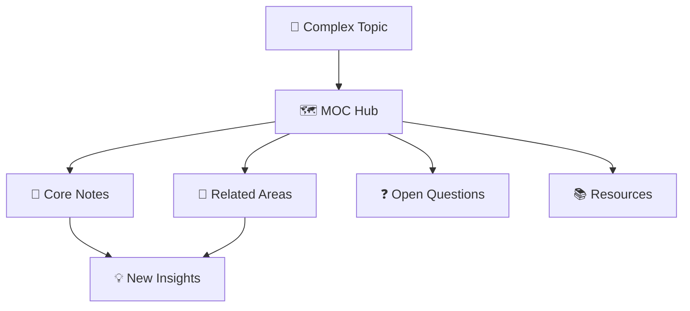

> [!orbit] Wayfinder | [[01-MOCs]] | [[Maps]] | [[MOC - About Notesℹ️]]

# 📋 MOCs Folder Contract

**What**: Navigation hubs—hand-curated maps organizing related knowledge by topic. Structural, not atomic; organize but don't contain knowledge.

**When**: Created when you accumulate 5+ related notes on a topic. Reviewed quarterly.

**Where**: `01-MOCs/` — topic maps, not reference for specific knowledge.

**Lifecycle**: Create when topic cluster forms. Curate and link. Archive if topic becomes obsolete.

---

## ✅ What Belongs Here

- Topic maps curating related notes (navigation only)
- MOCs, hubs, and organizational maps
- Index notes that structure knowledge areas
- Dashboard-style navigation pages

## ❌ What Doesn't Belong Here

- **Atomic knowledge notes** → [[02-Knowledge]] (even if they cover topic)
- **External sources** → [[04-Sources]] (not for organization)
- **Project work** → [[03-Efforts]] (actionable, time-bounded)

---
## 🔄 MOCs Workflow

---

## 📖 Real MOC Examples

> [!example]+ **MOC: Learning Systems**
> - **Purpose**: Organize knowledge about how people learn
> - **Core Notes**: `[[Spaced Repetition]]`, `[[Active Recall]]`, `[[Deliberate Practice]]`
> - **Entry Points**: Multiple ways to explore topic
> - **Integration**: Links from Area development, Learning efforts

> [!example]+ **MOC: Systems Thinking**
> - **Scope**: Principles of complex systems and feedback
> - **Curated Links**: 12+ concept notes, 3 application examples
> - **Update Cycle**: Monthly connection review
> - **Use**: Reference for systems-based project design

---

## 🔗 Integration Network

- [[01-MOCs]] → Folder hub
- [[+About Knowledgeℹ️]] → MOCs organize Knowledge notes
- [[+About Atomicsℹ️]] → Atomics cluster into MOCs
- [[+About Areasℹ️]] → MOCs support specific life areas with organized knowledge

---

⬆️ [[🏡Home]]  *| `= this.file.mtime`*