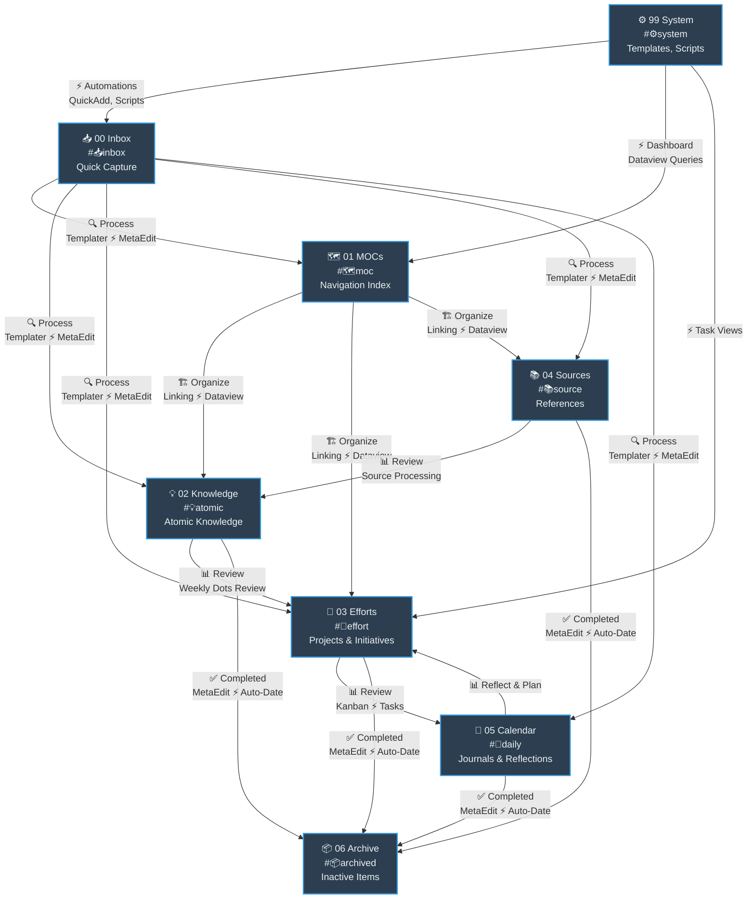

> [!orbit] Wayfinder | [[01-MOCs]] | 🗺️My PKM MOC | [[🏛️My PKM Governance]] | [[🔢My PKM Metadata]] | [[🔍My PKM Queries]] |  [[📁My PKM Folders]] |  [[🏷️My PKM Tags]] |  [[🔁My PKM Workflows]] | [[✅My PKM Tasks]] | [[ℹ️My PKM Naming Convention]]

## 🧭 The PKM Docs

| Note                           | What it holds                                                  |
| ------------------------------ | -------------------------------------------------------------- |
| [[🏛️My PKM Governance]]       | Every rule that governs this vault — compliance, DoD, Do/Don't |
| [[🔢My PKM Metadata]]          | YAML schema per note type; universal + type-specific fields    |
| [[🔍My PKM Queries]]           | Reusable Dataview and Bases query patterns                     |
| [[📁My PKM Folders]]           | Folder structure manual — what lives where and why             |
| [[🏷️My PKM Tags]]             | Tag taxonomy and canonical emoji-first tag forms               |
| [[🔁My PKM Workflows]]         | Capture→Archive pipelines and review cadences                  |
| [[✅My PKM Tasks]]              | Task conventions (#TASK) and task views                        |
| [[ℹ️My PKM Naming Convention]] | File naming rules — emoji prefixes, separators                 |
| [[MOC - Visual Identity]]      | Icons, colors, CSS classes, callout styles                     |
| [[00-Tutorial-Guide]]          | The 7-day guided tour for new users                            |

## 📄 All PKM documentation (live)

```dataview
TABLE WITHOUT ID file.link AS "Note", maturity AS "Maturity", modified AS "Modified"
FROM "99-System/Documentation/PKM"
SORT file.name ASC
```

## 🗺️ How the vault flows

#🌱develop 


⬆️ [[🏡Home]]  *| `= this.file.mtime`*
