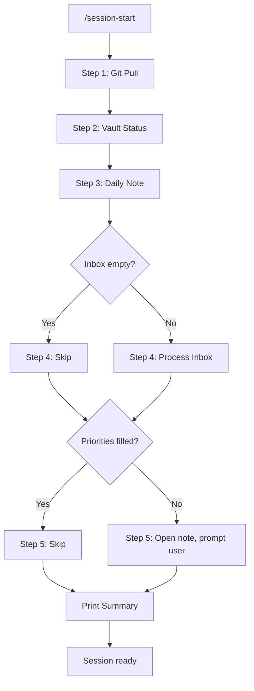

> [!orbit] Wayfinder | [[🔁My PKM Workflows]] | [[📍Note Classification Guide]] | [[⚡Workflow Quick Reference]]

# Session Start Playbook

## Purpose

Standardized routine for opening a Claude Code + Origin vault session. Ensures the vault is synced, today's workspace is ready, and inbox items don't pile up.

**When to use:** At the start of every work session, before doing any vault work.

**How to run:** In Claude Code, type `/session-start`

---

## Steps at a Glance

| # | Step | Type | Guard | What happens |
|---|------|------|-------|-------------|
| 1 | Git Pull | Auto | None | Pull latest changes from remote |
| 2 | Vault Status | Auto | None | Check inbox count, active projects |
| 3 | Daily Note | Auto | Skips if exists | Create or open today's daily note |
| 4 | Inbox Processing | Conditional | Skips if inbox = 0 | Interactive filing of inbox items |
| 5 | Today's Focus | Manual | Skips if filled | Set top 3 priorities for the day |

---

## Step Details

### Step 1: Git Pull

Pulls latest vault changes from the remote repository. Always safe — if already up to date, reports so.

**Expected output:** `Already up to date.` or list of changed files.

### Step 2: Vault Status

Read-only snapshot of vault state. Reports:
- Number of items in `+Inbox/`
- Number of active projects in `03-Efforts/On/`
- Whether today's daily note exists
- Uncommitted git changes

This step also feeds the inbox count to Step 4's guard.

### Step 3: Daily Note

Creates today's daily note in `05-Calendar/Daily/` using the standard template. If the note already exists, opens it without overwriting.

**Expected output:** File created or existing file opened in Obsidian.

### Step 4: Inbox Processing

Interactive loop through inbox items — read, summarize, and choose: file, action, delete, or skip.

**Guard:** If inbox is empty (0 items from Step 2), this step is skipped entirely.

### Step 5: Today's Focus

Opens the daily note and prompts you to fill in your top 3 priorities under the "Today's Focus" section.

**Guard:** If priorities are already filled in, reports done and skips.

---

## Flow Diagram



---

## Idempotency

Running `/session-start` multiple times is safe:

- **Git pull** on a clean repo returns "Already up to date"
- **Vault status** is read-only
- **Daily note** checks for existing file before creating
- **Inbox** skips if already processed to zero
- **Focus** skips if priorities are already written

---

## Example Output

```
Session Start — 2026-02-28
━━━━━━━━━━━━━━━━━━━━━━━━━━━━━━━━━
Step 1  Git Pull           ✅  Already up to date
Step 2  Vault Status       ✅  📥 4 inbox · 🎯 2 projects
Step 3  Daily Note         ✅  Created 2026-02-28.md
Step 4  Inbox              ⚡  4 items → processing
Step 5  Today's Focus      📝  Fill in your Top 3
━━━━━━━━━━━━━━━━━━━━━━━━━━━━━━━━━
Session ready.
```

---

## Related

- [[🔁My PKM Workflows]] — all vault workflows
- `/origin-status` — standalone vault status check
- `/daily-note` — standalone daily note creation
- `/inbox-process` — standalone inbox processing
- `/session-close` — the companion end-of-session routine

⬆️ [[🏡Home]]  *| `= this.file.mtime`*
