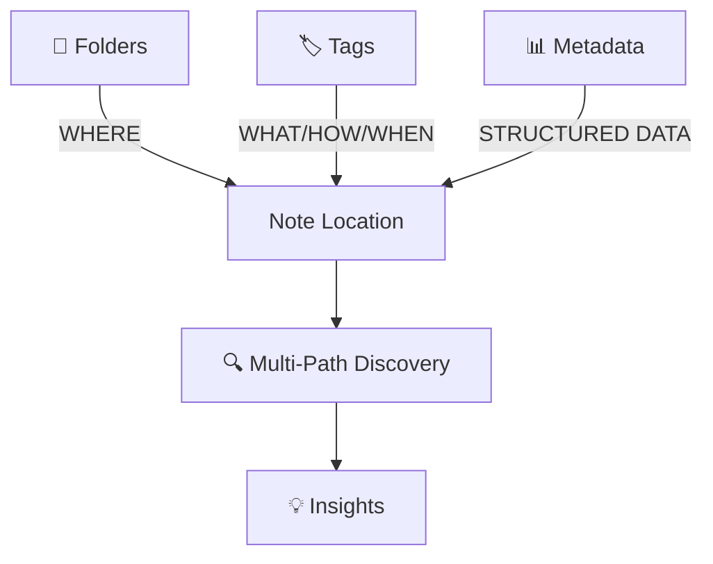
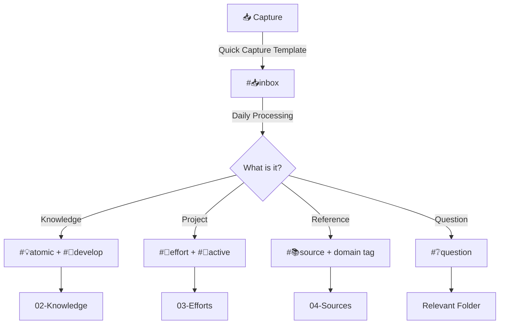

> [!orbit] Wayfinder | [[🗺️My PKM MOC]] | [[🏛️My PKM Governance]] | [[🔢My PKM Metadata]] | [[🔍My PKM Queries]] |  [[📁My PKM Folders]] | 🏷️My PKM Tags |  [[🔁My PKM Workflows]] | [[✅My PKM Tasks]] | [[ℹ️My PKM Naming Convention]]

## 💡 Content Type Tags  
🗂️ `#💡atomic`, `#🚀effort`, `#📚source`, `#🗺️MOC`, `#🤝meeting`

## 🔄 Workflow Status Tags  
📥 → 🔄 → ⏳ → ✅ → 📦  

## 🌱 Development Lifecycle  
📤 → 🌱 → 🧹 → ⚗️ → 🌲  

## Maturity Evolve
📤 → 🌱 → 🪴 → 🌲 →  🍓

## 🎯 Priority Tags  
🚨 `#urgent` · ⭐ `#important` · ⚡ `#quick-win` — flat tags only; `priority/*` as a namespace was retired 2026-07-27 (closed 3-value set, see `CIS_TAG.md`). Use the locked `priority:` YAML field for the graded scale instead.

## 🧭 Domain & Topic  
`domain/<emoji><word>` (open, cross-cutting) · `people/*`, `place/*`, `season/*` (same open-namespace pattern) · `skill/*`, `project/*` — full policy + current values in `## 🎓 Topic & Domain Tags` below and in `CIS_TAG.md`.

> [!tip] Tag health monitoring → [[Tags - Status Check]]

# 🏷️ PKM Tags System

> [!info]+ **⚡ Tags Overview**
> **Purpose**: Multi-dimensional knowledge organization beyond folder hierarchy  
> **Philosophy**: Tags complement folders - folders = location, tags = attributes  
> **Automation**: Template-based auto-tagging + hotkey favorites  
> **Maintenance**: Quarterly tag audit and pruning

---

## 🎯 Tag System Philosophy




### **Core Principles**

> [!success]+ **Tagging Best Practices**
> - ✅ **Folders answer WHERE** - Physical location
> - ✅ **Tags answer WHAT/HOW/WHEN** - Attributes and context
> - ✅ **Emoji-First** - Visual scan-ability (optional text after)
> - ✅ **Hierarchical When Needed** - Use `/` for sub-categories
> - ✅ **Template Auto-Tagging** - Reduce manual overhead
> - ✅ **Regular Pruning** - Remove unused tags quarterly

---

## 📊 Complete Tag Taxonomy

### **🗂️ 1. Content Type Tags**

> [!note]+ **Purpose**
> Identify note type quickly, especially for notes outside their standard folders

| Tag | Emoji | Primary Folder | Use Case | Auto-Tagged |
|-----|-------|---------------|----------|-------------|
| `#💡atomic` | 💡 | `02-Knowledge/Atomics` | Knowledge atoms, concepts | ✅ Template |
| `#🚀effort` | 🚀 | `03-Efforts` | Projects and active work | ✅ Template |
| `#📚source` | 📚 | `04-Sources` | External reference material | ✅ Template |
| `#🗺️MOC` | 🗺️ | `01-MOCs` | Maps of Content, topic hubs | ✅ Template |
| `#🤝meeting` | 🤝 | `04-Sources/Meetings` | Meeting notes | ✅ Template |
| `#📅daily` | 📅 | `05-Calendar/Daily` | Daily notes | ✅ Periodic Notes |
| `#📅weekly` | 📅 | `05-Calendar/Weekly` | Weekly reviews | ✅ Periodic Notes |
| `#📅monthly` | 📅 | `05-Calendar/Monthly` | Monthly reflections | ✅ Periodic Notes |
| `#👤person` | 👤 | `02-Knowledge/People` | Person profiles | ✅ Template |
| `#🗺️place` | 🗺️ | `02-Knowledge/Places` | Location notes | ✅ Template |
| `#🛠️tool` | 🛠️ | `02-Knowledge/Tools` | Tool documentation | ✅ Template |
| `#🎯prompt` | 🎯 | `99-System/Prompts` | AI prompts and templates | ✅ Template |

---

### **📥 2. Workflow Status Tags**

> [!gear]+ **Purpose**
> Track note lifecycle and workflow stage  
> **⚠️ Important**: Use YAML `status:` metadata primarily, tags as visual supplement

| Tag           | Emoji | Meaning                    | Folder Movement        | Query Use             |
| ------------- | ----- | --------------------------- | ----------------------- | ---------------------- |
| `#📥inbox`    | 📥    | Unprocessed capture        | `+Inbox`               | Daily processing list |
| `#🔄active`   | 🔄    | Currently working on       | All folders            | Active work dashboard |
| `#⏳waiting`   | ⏳     | Blocked, waiting for input | All folders            | Follow-up reminders   |
| `#✅completed` | ✅     | Finished, ready to archive | Pre-archive            | Archive preparation   |
| `#📦archived` | 📦    | Long-term storage          | `06-Archive`           | Archived items query  |
| `#⏸️paused`   | ⏸️    | Temporarily inactive       | `03-Efforts/Paused` | Someday/maybe list    |
| `#❌cancelled` | ❌     | Abandoned, not pursuing    | `06-Archive/Cancelled` | Lessons learned       |

**Workflow Progression**:
📥 inbox → 🔄 active → ✅ completed → 📦 archived  
↘ ⏸️ paused  
↘ ❌ cancelled

---

### **🌱 3. Development Lifecycle Tags**

> [!growth]+ **Purpose**
> Track knowledge maturity and content development needs

| Tag | Emoji | Stage | Action Required | Template Auto-Tag |
|-----|-------|-------|-----------------|-------------------|
| `#📤seed` | 📤 | Raw capture | Add structure | ✅ Quick Capture |
| `#🌱develop` | 🌱 | Needs expansion | Develop content | ✅ Idea Template |
| `#❔question` | ❔ | Research needed | Answer questions | Manual |
| `#🧹tidy` | 🧹 | Needs cleanup | Reorganize/refactor | Manual |
| `#⚗️experiment` | ⚗️ | Testing phase | Evaluate results | Manual |
| `#🚤floating` | 🚤 | No clear home yet | Find proper location | Manual |
| `#🌲evergreen` | 🌲 | Stable, mature | Maintain & reference | Promoted manually |

**Development Query** (Weekly Review):

```
TABLE WITHOUT ID  
file.link as "Note",  
tags as "Development Tags",  
modified as "Last Updated"  
WHERE contains(tags, "#🌱develop")  
OR contains(tags, "#❔question")  
OR contains(tags, "#🧹tidy")  
SORT modified ASC  
LIMIT 20
```


---

### **🎯 4. Priority & Urgency Tags**

> [!fire]+ **Purpose**
> Quick visual indicators for important work  
> **Integration**: Works with GTD Eisenhower Matrix

> [!note]+ **`priority/*` namespace retired (2026-07-27)**
> `priority/high`/`priority/medium`/`priority/low` were removed as a tag namespace — a closed, 3-value set fails the open-vocabulary test in `CIS_TAG.md`'s "Topic & Domain" policy. The locked `priority:` YAML field (`CIS_PRIORITY.md`) already covers the graded scale; the flat tags below cover ad-hoc flagging.

| Tag | Emoji | Meaning | Use Case | Query Visibility |
|-----|-------|---------|----------|------------------|
| `#urgent` | 🚨 | Time-sensitive | Deadline pressure | Urgent alerts |
| `#important` | ⭐ | High impact | Strategic value | Focus work |
| `#quick-win` | ⚡ | Fast results | 5-15 min tasks | Energy fillers |

**Priority Matrix Query** (uses the YAML `priority` field, not a tag namespace):
```
TABLE WITHOUT ID  
file.link as "Item",  
priority as "Priority",  
tags as "Tags"  
WHERE contains(tags, "#urgent")  
SORT priority DESC, modified DESC
```

---

### **🎓 5. Topic & Domain Tags**

> [!book]+ **Purpose**
> Thematic organization across folder boundaries  
> **Structure**: Hierarchical when beneficial

> [!info]+ **Namespace policy (resolved 2026-07-27, see `CIS_TAG.md`)**
> Format: `namespace/<emoji><word>`. **Pass** when the vocabulary is open/growing (unbounded, new values expected) AND cross-cutting across multiple note types (not already anchored by one hub note's wikilink) — `domain/*` and `people/*` pass today. **No-go** when the set is closed and small (roughly ≤5 fixed values) — use flat tags or a locked YAML enum instead. `energy/*`, `context/*`, `priority/*` failed this test and were retired (see Section 4 above).

#### **Knowledge Domains — `domain/*`** (planned for MAIN migration, not yet applied to any note)

| Tag Pattern | Examples | Use Case |
|-------------|----------|----------|
| `#domain/` | `#domain/💭emotions` | Emotions MOC |
| | `#domain/🧪testing` | Testing MOC |
| | `#domain/💻it` | IT MOC |
| | `#domain/🌱selfdevelopment` | Self-Development MOC |
| | `#domain/💬communication` | Communication MOC |
| | `#domain/☢️3dprint` | 3D Printing MOC |
| | `#domain/🕹️gaming` | Gaming MOC |

#### **Area cross-tags — `domain/*`** (planned, not yet applied)

| Tag Pattern | Examples | Use Case |
|-------------|----------|----------|
| `#domain/` | `#domain/🧬health` | Health Area cross-tag |
| | `#domain/💰finance` | Finance Area cross-tag |
| | `#domain/💼career` | Career Area cross-tag |
| | `#domain/💞relationships` | Relationships Area cross-tag |
| | `#domain/🧘personal` | Personal Area cross-tag |

#### **`people/*`** (pattern only — no values reserved)

| Tag Pattern | Examples | Use Case |
|-------------|----------|----------|
| `#people/` | `#people/👨‍👩‍👧family`, `#people/🎨cultural` | Ties to Relationships Area + `People` knowledge type |

<!-- Parked, not added — kept for later consideration, not deleted. Un-comment only once a real cross-cutting need shows up.
#### Place/Season/Skill/Project — parked
| Tag Pattern | Examples | Use Case |
|-------------|----------|----------|
| `#place/` | `#place/🏠home`, `#place/✈️travel` | Ties to `Places` knowledge type |
| `#season/` | `#season/🎓university`, `#season/💼job-x` | Temporal life-chapter grouping — not captured by folders or Areas |
| `#skill/` | `#skill/programming`, `#skill/writing`, `#skill/leadership` | Skill categories |
| `#project/` | `#project/learning`, `#project/building`, `#project/shipping` | Project categories |
-->

---

### **🔬 6. Source & Reference Tags**

> [!book]+ **Purpose**
> Categorize external content and reading material

| Tag | Emoji | Source Type | Processing Stage | Action |
|-----|-------|-------------|------------------|--------|
| `#source/book` | 📚 | Books | Reading | Progressive summarization |
| `#source/article` | 📰 | Articles | Quick read | Extract key ideas |
| `#source/video` | 🎥 | Videos | Watch | Note timestamps |
| `#source/podcast` | 🎙️ | Podcasts | Listen | Episode highlights |
| `#source/course` | 🎓 | Courses | Learning | Module notes |
| `#source/paper` | 📄 | Research papers | Study | Citation tracking |
| `#source/web` | 🌐 | Web content | Clip | Archive URL |

**Reading Status Sub-Tags**:
- `#status/unread` - In queue
- `#status/reading` - Currently processing
- `#status/completed` - Finished and extracted
- `#status/reference` - Keep for lookup

---

### **🌍 7. Special Context Tags**

> [!globe]+ **Purpose**
> Additional context for organization and filtering

| Tag | Emoji | Purpose | Use Case |
|-----|-------|---------|----------|
| `#lang/en` | 🇬🇧 | English content | Language filtering |
| `#lang/cs` | 🇨🇿 | Czech content | Native language |
| `#public` | 🌐 | Shareable externally | Publishing candidates |
| `#private` | 🔒 | Personal only | Privacy filtering |
| `#review/daily` | 📅 | Daily review | Routine checklist |
| `#review/weekly` | 📅 | Weekly review | Weekly ritual |
| `#review/monthly` | 📅 | Monthly reflection | Monthly reflection |
| `#favorite` | ⭐ | Frequently referenced | Quick access |
| `#template` | 📋 | Note template | Template library |

---

## 🔄 Workflow Integration

### **Daily Capture → Processing Workflow**





### **Tag Assignment by Template**

| Template | Auto-Tags | Manual Tags to Add |
|----------|-----------|-------------------|
| **Quick Capture** | `#📥inbox`, `#📤seed` | Domain |
| **Atomic** | `#💡atomic`, `#🌱develop` | Domain, maturity |
| **Effort** | `#🚀effort`, `#🔄active` | Priority (`priority:` field), domain |
| **Source** | `#📚source`, `#status/unread` | Source type, domain |
| **Meeting** | `#🤝meeting`, `#📅daily` | Participants, project |
| **Daily Note** | `#📅daily`, `#🔄active` | Focus area, mood |

---

## 🎯 Hotkey Integration

### **Alt+T - Quick Tag Favorites**

Most-used tag combinations for rapid tagging:

🚀 Priority Boost:
- `#urgent`
- `#important`
- `#quick-win`
🌱 Development Tags:
- `#🌱develop`
- `#🧹tidy`
- `#❔question`
🎓 Domain Tags:
- `#domain/🧪testing`
- `#domain/💻it`
- `#domain/💭emotions`

---
## 📊 Tag-Based Queries
### **1. Daily Processing Dashboard**
```
TABLE WITHOUT ID  
file.link as "Item",  
tags as "Tags",  
created as "Captured"  
FROM #📥inbox  
WHERE contains(tags, "#📥inbox")  
SORT created DESC  
LIMIT 20
```

### **2. Active Work Dashboard**

```
TABLE WITHOUT ID  
file.link as "Active Work",  
priority as "Priority",  
tags as "Context"  
WHERE contains(tags, "#🔄active")  
AND !contains(tags, "#📦archived")  
SORT priority DESC, modified DESC
```

### **3. Development Pipeline**

```
TABLE WITHOUT ID  
file.link as "Developing",  
tags as "Stage",  
modified as "Last Edit"  
WHERE contains(tags, "#🌱develop")  
OR contains(tags, "#❔question")  
OR contains(tags, "#🧹tidy")  
SORT modified ASC  
LIMIT 15
```


### **4. Urgent Items**

```
TASK  
WHERE contains(tags, "#urgent")  
AND !completed  
GROUP BY file.link

```


### **5. Domain-Based Work Lists**

```
TABLE WITHOUT ID  
file.link as "Note",  
tags as "Domain Tags"  
WHERE contains(tags, "#domain/💻it")  
AND status = "🔄active"
```

---

## 🩺 Tag Health Monitoring 
### **Orphan Tags Query** (Unused Tags)

```
TABLE WITHOUT ID  
tag as "Tag",  
length(rows) as "Usage Count"  
FROM ""  
FLATTEN file.tags as tag  
GROUP BY tag  
SORT length(rows) ASC  
LIMIT 20
```

### **Over-Tagged Notes Query**

```
TABLE WITHOUT ID  
file.link as "Note",  
length(file.tags) as "Tag Count",  
file.tags as "Tags"  
FROM ""  
WHERE length(file.tags) > 10  
SORT length(file.tags) DESC
```
### **Missing Critical Tags**

```
TABLE WITHOUT ID  
file.link as "Note",  
type as "Type",  
tags as "Tags"  
FROM "02-Knowledge" OR "03-Efforts"  
WHERE !contains(tags, "#💡atomic")  
AND !contains(tags, "#🚀effort")  
AND !contains(tags, "#📚source")  
AND type != "moc"
```

---

## 🧹 Tag Maintenance Workflow

### **Quarterly Tag Audit** (Every 3 months)

**Audit Checklist**:
- Run orphan tags query - remove unused tags
- Check over-tagged notes - simplify
- Review tag consistency - fix variations
- Update tag documentation - add new, remove old
- Bulk rename tags if needed (MetaEdit plugin)
- Update templates with new auto-tags

**Tag Pruning Rules**:
1. **Less than 3 uses** - Candidate for removal
2. **Duplicate meaning** - Consolidate tags
3. **Unclear purpose** - Define or delete
4. **Never in queries** - Remove if not useful

---

## ✅ Tag Best Practices

### **Do's ✅**

- ✅ Use emoji-first format for visual scanning
- ✅ Auto-tag via templates whenever possible
- ✅ Keep tags consistent (same emoji + text)
- ✅ Use hierarchical tags for sub-categories (`#domain/💻it`)
- ✅ Review and prune unused tags quarterly
- ✅ Combine tags with YAML metadata (not duplicating)
- ✅ Use tags in Dataview queries for insights

### **Don'ts ❌**

- ❌ Create duplicate tags (e.g., `#idea` and `#💡idea`)
- ❌ Over-tag notes (10+ tags = too many)
- ❌ Use tags to replace proper folder organization
- ❌ Create one-off tags without clear use case
- ❌ Ignore tag variations (inconsistency)
- ❌ Tag everything the same way (lose signal)
- ❌ Forget to update templates when adding new tags
- ❌ Add a new hierarchical namespace without checking it against the open/closed test in `CIS_TAG.md` first

---

## 🚀 Getting Started with Tags

### **Week 1: Foundation**
- [ ] Review existing tags in vault
- [ ] Add critical tags to templates
- [ ] Set up Alt+T quick tag favorites
- [ ] Practice daily inbox processing with tags

### **Week 2-4: Habit Building**
- [ ] Tag notes consistently during capture
- [ ] Use domain and priority tags actively
- [ ] Run weekly development pipeline query
- [ ] Refine auto-tagging in templates

### **Month 2+: Mastery**
- [ ] Create custom tag-based dashboards
- [ ] Optimize tag combinations for workflows
- [ ] Conduct first quarterly tag audit
- [ ] Share tag system with community

---

## 🔗 Related System Notes

- [[MOC - Visual Identity]] – Visual standards hub (emoji-first tags documented here)
- [[🙂Icon Reference & Color System]] – Canonical icon/emoji catalog these tags draw from
- [[🔢My PKM Metadata]] - YAML metadata standards
- [[🔁My PKM Workflows]] - How tags enable workflows
- [[📁My PKM Folders]] - Folder structure guide
- [[🔍My PKM Queries]] - Dataview query collection
- [[+About Templatesℹ️]] - Auto-tagging configuration

---

> [!quote]+ **💭 Tagging Philosophy**
> *"Tags are the connective tissue of your PKM - they reveal patterns across folders, enable flexible queries, and surface insights that folder hierarchies hide. Tag deliberately, not exhaustively. Let templates do the work."*

----

⬆️ [[🏡Home]]  *| `= this.file.mtime`*
