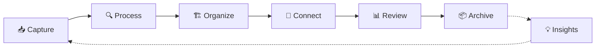
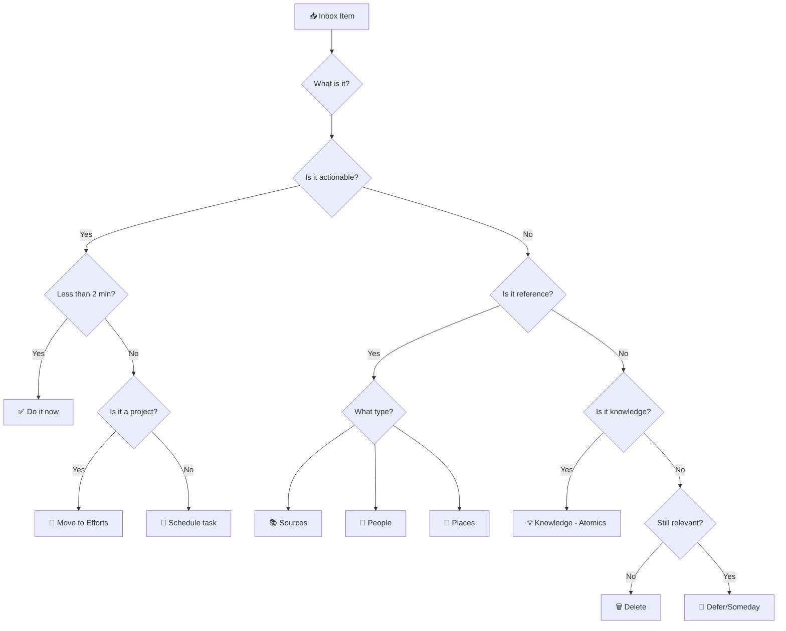

> [!orbit] Wayfinder | [[🗺️My PKM MOC]] | [[🏛️My PKM Governance]] | [[🔢My PKM Metadata]] | [[🔍My PKM Queries]] |  [[📁My PKM Folders]] |  [[🏷️My PKM Tags]] | 🔁My PKM Workflows | [[✅My PKM Tasks]] | [[ℹ️My PKM Naming Convention]]

> [!info]+ **⚡ System Overview**
> **Purpose**: Your complete workflow guide from capture to archive  
> **Philosophy**: Capture everything, process systematically, connect intelligently, review regularly  
> **Core Principle**: Frictionless input, deliberate processing, emergent organization

---

## 📊 The Complete Knowledge Lifecycle

---





**Status Flow**: 📥inbox → 🔄active → ⏳waiting → ✅completed → 📦archived

#### Status Transition Decision Tree

| Current Status | Transition To | When? |
|---------------|--------------|-------|
| `📥inbox` | `🔄active` | You've processed the note and are working on it |
| `🔄active` | `⏳waiting` | Blocked by external dependency (person, event, info) |
| `🔄active` | `✅completed` | All tasks done, deliverable met |
| `🔄active` | `⏸️paused` | Deliberately pausing — not blocked, just deprioritized |
| `⏳waiting` | `🔄active` | Blocker resolved, ready to resume |
| `✅completed` | `📦archived` | Learnings extracted, ready to move to `06-Archive/` |
| Any | `❌cancelled` | No longer relevant, won't be completed |

**Scripts**: Use the QuickAdd Capture entries `➡️Status Progression NEXT` / `⬅️Status Progression PREV` for linear advance, or `status-picker.js` (Commander button) for any-to-any transition. See [[🔧Scripts Reference]].
### Information Flow Diagram

```
┌─────────────┐    ┌──────────────┐    ┌─────────────┐
│  External   │───▶│  00-Inbox    │───▶│ Processing  │
│ Information │    │ (Capture)    │    │ (Decision)  │
└─────────────┘    └──────────────┘    └─────────────┘
                                              │
    ┌─────────────────────────────────────────┴─────────────────────────────────────────┐
    │                                                                                   │
    ▼                          ▼                          ▼                            ▼
┌─────────────┐    ┌─────────────────┐    ┌─────────────────┐    ┌─────────────────┐
│02-Knowledge │    │03-Efforts       │    │04-Sources       │    │01-MOCs          │
│(Knowledge)  │    │(Projects)       │    │(References)     │    │(Navigation)     │
└─────────────┘    └─────────────────┘    └─────────────────┘    └─────────────────┘
    │                          │                          │                            │
    └─────────────────────────────────────────┬─────────────────────────────────────────┘
                                              │
                                              ▼
                                    ┌─────────────────┐
                                    │05-Calendar      │
                                    │(Reflection)     │
                                    └─────────────────┘
                                              │
                                              ▼
                                    ┌─────────────────┐
                                    │06-Archive       │
                                    │(Completed)      │
                                    └─────────────────┘
```

```
   For each item, ask: "What is it?"
   ├─ Actionable? → 03-Efforts (Project) or schedule as task
   ├─ Reference? → 04-Sources or 02-Knowledge (People/Tools/Places)
   ├─ Knowledge? → 02-Knowledge/Atomics (Atomic note)
   └─ Delete if no longer relevant
```
   
---

## 🎯 Core Workflow Stages

### **1. 📥 Capture — Frictionless Input**

> [!success]+ **Capture Excellence**
> **Principle**: Capture everything without friction. Trust the system, not your memory.

#### **What to Capture**
- 💭 Fleeting thoughts and ideas
- 📱 Voice memos and mobile captures
- 📝 Meeting notes and conversations
- 🌐 Web clips and highlights
- 📚 Book excerpts and quotes
- ✅ Quick tasks and reminders
- ❓ Questions to explore later

#### **How to Capture**
| Method | Tool | Use Case | Speed |
|--------|------|----------|-------|
| **Quick Capture Template** | Templater hotkey | Instant thought capture | ⚡⚡⚡ |
| **Mobile** | Obsidian mobile app | On-the-go ideas | ⚡⚡ |
| **Voice Memo** | Voice recorder → transcribe | Hands-free capture | ⚡⚡ |
| **Web Clipper** | Browser extension | Article highlights | ⚡⚡ |
| **QuickAdd** | Plugin macro | Structured quick entry | ⚡⚡⚡ |

#### **Capture Best Practices**
- ✅ Add minimal context (who/what/why/when)
- ✅ Use consistent capture method per situation
- ✅ Don't organize during capture
- ✅ Trust you'll process within 24-48 hours
- ✅ Timestamp everything automatically

**Destination**: All captures → `+Inbox` folder

---

### **2. 🔍 Process — GTD-Inspired Triage**

> [!gear]+ **Processing Ritual**
> **Time**: 10 minutes daily (morning ideal)  
> **Goal**: Empty inbox or keep under 20 items  
> **Method**: GTD decision tree

#### **Processing Decision Tree**



#### **Processing Questions** (Ask for each item)

1. **What is it?** - Clarify content and context
2. **Is it actionable?**
   - Yes → Move to Efforts or create task
   - No → Continue
3. **Is it reference material?**
   - Yes → Process to Sources/People/Places
   - No → Continue
4. **Is it knowledge/insight?**
   - Yes → Develop into Dots (Atomic/Concept/Idea)
   - No → Continue
5. **Does it take less than 2 minutes?**
   - Yes → Do immediately
   - No → Schedule or defer
6. **Is it still relevant?**
   - No → Delete without guilt
   - Yes → Add to someday/maybe list

#### **Processing Destinations**

| Item Type | Folder | Template | Metadata |
|-----------|--------|----------|----------|
| **Project idea** | `03-Efforts` | Effort Template | `type: effort`, `status: 🔄active` |
| **Knowledge insight** | `02-Knowledge/Atomics` | Atomic/Concept Template | `type: atomic`, `maturity: 📤seed` |
| **External content** | `04-Sources` | Source Template | `type: source`, `status: 🔄active` |
| **Person info** | `02-Knowledge/People` | Person Template | `type: person` |
| **Quick task** | Current Daily Note | Task format | `- [ ] Task` with deadline |
| **Meeting notes** | `04-Sources/Meetings` | Meeting Template | `type: meeting` |
| **Someday/Maybe** | `03-Efforts/Paused` | - | `status: ⏸️paused` |

[[GtD - Getting Things Done|Read more ...]]

---

### **3. 🏗️ Organize — Structure & Metadata**

> [!abstract]+ **Organization Principles**
> **Goal**: Make information findable through multiple pathways  
> **Methods**: Folders + Tags + Links + Metadata

#### **Folder Organization**
![[📁My PKM Folders#🏗️ Structure]]

[[📁My PKM Folders|Read more]]
#### **Metadata Standards**

**Universal YAML** (all notes):
![[🔢My PKM Metadata#📊 Universal Metadata Schema]]


> Canonical source: [[CIS_MATURITY]] · [[CIS_STATUS]] · [[CIS_PRIORITY]]

**Type-Specific Extensions**:
- **Atomics**: `maturity: 📤seed|🌱seedling|🪴sapling|🌲evergreen|🍓fruit`
- **Efforts**: `due: YYYY-MM-DD`, `priority: high|medium|low`, `next_action: ""`
- **Sources**: `author: ""`, `source_type: book|article|video`, `read_status: unread|reading|completed`
- **MOCs**: `coverage_areas: ""`, `last_review: YYYY-MM-DD`

[[🔢My PKM Metadata|Read more]]

---
#### **Tagging Strategy**

Tags complement folders — folders = WHERE, tags = WHAT/HOW → [[🏷️My PKM Tags]]

---

### **4. 🔗 Connect — Build Knowledge Networks**

> [!tip]+ **Connection Principles**
> **Goal**: Surface insights through relationship mapping  
> **Method**: Link deliberately, not exhaustively

#### **Linking Types**

**Direct Links** `[[Note Name]]`:
- Core relationships between concepts
- Project dependencies
- Source attribution
- MOC membership

**Typed Links** (inline annotation): #🌱develop Create examples use cases
- `supports` - Reinforces the idea
- `contradicts` - Challenges the concept
- `depends_on` - Prerequisite relationship
- `informs` - Provides context
- `instance_of` - Example relationship

**Backlinks** (automatic):
- Review weekly for unexpected connections
- Use for discovery of related content
- Identify hub notes (many inbound links)

#### **Connection Workflows**

**Daily Connection** (5 minutes):
- Review today's new notes
- Add 2-3 relevant links per note
- Update related MOCs

**Weekly Connection** (15 minutes):
- Explore graph view for clusters
- Connect orphan notes (no links)
- Strengthen weak connections

**Monthly Connection** (30 minutes):
- Identify hub notes for MOC promotion
- Refactor over-connected notes
- Clean broken links

---

### **5. 📊 Review — Maintain System Health**

> [!gear]+ **Review Rhythms**
> **Philosophy**: Regular review prevents system entropy  
> **Method**: Time-boxed, systematic evaluation

#### **Daily Review** ⏱️ 10-15 minutes

**Morning Routine**:
- [ ] Process Inbox (10 min max)
- [ ] Review today's calendar and tasks
- [ ] Check Dashboard for priorities
- [ ] Plan 3 Most Important Tasks (MITs)

**Evening Reflection**:
- [ ] Log wins and learnings in Daily Note
- [ ] Capture fleeting thoughts before forgetting
- [ ] Move completed tasks to archive
- [ ] Set intentions for tomorrow
---
#### **Weekly Review** ⏱️ 30-45 minutes

**Structure**:
1. **Clear Completed** (10 min)
   - [ ] Archive completed Efforts
   - [ ] Mark finished tasks as ✅
   - [ ] Update project statuses

2. **Review Active Work** (15 min)
   - [ ] Check all active Efforts
   - [ ] Update `next_action` for stalled projects
   - [ ] Adjust priorities and deadlines
   - [ ] Move `⏳waiting` items if unblocked

3. **Process Development Tags** (10 min)
   - [ ] Clean `#🧹tidy` notes
   - [ ] Research `#❔question` items
   - [ ] Develop `#🌱develop` atomics
   - [ ] Evaluate `#⚗️experiment` results

4. **Connect & Reflect** (10 min)
   - [ ] Random Dot review (find 3 connections)
   - [ ] Update relevant MOCs
   - [ ] Compress Daily Note highlights to Weekly summary
   - [ ] Plan next week's priorities


---

#### **Monthly Review** ⏱️ 60-90 minutes

**Structure**:
1. **System Cleanup** (20 min)
   - [ ] Archive all completed work
   - [ ] Clean unused tags
   - [ ] Review and update metadata standards
   - [ ] Expire temporary focus tags
   - [ ] Backup vault to cloud/Git

2. **Topic Promotion Check** (20 min)
   - [ ] Identify Efforts with ≥7 atomic notes
   - [ ] Promote mature topics to MOCs
   - [ ] Create new MOC structure
   - [ ] Update folder organization

3. **Template & Query Optimization** (15 min)
   - [ ] Review template usage stats
   - [ ] Optimize frequently-used templates
   - [ ] Update Dataview queries
   - [ ] Refine automation workflows

4. **Performance Metrics** (15 min)
   - [ ] Review capture rates (new notes/week)
   - [ ] Check link density (avg links/note)
   - [ ] Analyze tag distribution
   - [ ] Assess note maturity progression
   - [ ] Evaluate vault health score

**Monthly Dashboard Metrics**:
- 📊 Total notes created this month
- 🔗 Average link density
- 📥 Inbox processing time average
- 🌱 Maturity progression (seed → evergreen)
- 🚀 Active efforts count
- 📦 Items archived this month

---

#### **Quarterly Review** ⏱️ 2-3 hours

**Structure**:
1. **System Audit** (60 min)
   - [ ] What's working? (Keep doing)
   - [ ] What's friction? (Fix or remove)
   - [ ] What's unused? (Archive or delete)
   - [ ] What's missing? (Add selectively)

2. **Workflow Optimization** (45 min)
   - [ ] Review plugin list and usage
   - [ ] Update hotkeys and shortcuts
   - [ ] Optimize capture methods
   - [ ] Refine processing workflows
   - [ ] Test new tools/methods

3. **Knowledge Architecture** (30 min)
   - [ ] Review folder structure relevance
   - [ ] Assess MOC effectiveness
   - [ ] Evaluate tagging strategy
   - [ ] Consider structural improvements

4. **Vision Alignment** (15 min)
   - [ ] Does PKM serve current goals?
   - [ ] Are workflows aligned with priorities?
   - [ ] What knowledge domains need focus?
   - [ ] Set intentions for next quarter

---

### **6. 📦 Archive — Preserve & Release**

> [!success]+ **Archive Philosophy**
> **Goal**: Keep active workspace clean while preserving knowledge  
> **Method**: Deliberate archival with full context

#### **What to Archive**

**Completed Work**:
- ✅ Finished projects and efforts
- ✅ Closed action items
- ✅ Obsolete sources and references
- ✅ Superseded MOCs and structures

**Inactive Knowledge**:
- No edits in 90+ days
- No backlinks or references
- Low relevance to current work
- Historical value only

#### **Archival Process**

**Pre-Archive Checklist**:
- [ ] Status = ✅ completed
- [ ] All tasks closed
- [ ] Key learnings extracted to atomics
- [ ] Relevant links preserved
- [ ] Archive reason documented

**Archive Workflow**:
1. Set `status: 📦archived`
2. Add `archived_date: YYYY-MM-DD`
3. Add `archive_reason: "description"`
4. Move to `06-Archive/Completed` or `06-Archive/Inactive`
5. Update any linking MOCs

**Archive Structure**:
06-Archive/  
├── Completed/ # Successfully finished  
└── Inactive/ # Low-relevance, dormant


---

## 🤖 Extended Workflows

### **Prompt System Workflow**

The vault includes a full prompt management system in `99-System/Prompts/` for AI prompt templates.

**Prompt Lifecycle**:
```
Create → Classify → Promote → Archive

📥inbox → 🔄active → ✅completed → 📦archived
```

| Stage | `status` | Location | Description |
|-------|----------|----------|-------------|
| **Draft** | `📥inbox` | `99-System/Prompts/Workbench/` | New prompt being tested |
| **Active** | `🔄active` | `99-System/Prompts/Reference/` | In regular use, proving value |
| **Winner** | `✅completed` | `99-System/Prompts/Reference/` | Best-in-class for its category |
| **Archived** | `📦archived` | `99-System/Prompts/Archive/` | Superseded or no longer needed |

> [!warning] The separate `prompt_status` field is **retired** — it was collapsed into the vault-wide `status` field (code/template cleanup completed 2026-07-24). Prompts carry only `status`. Do not re-introduce `prompt_status`.

**Creating Prompts**:
- **Full prompt**: Use `Templates/Create/new-prompt.md` — complete template with structured sections
- **Quick prompt**: Use `Templates/Create/new-quick-prompt.md` — minimal YAML + instruction block

**Normalizing Legacy Prompts**: `normalize_prompts.js` was a one-shot migration script, deleted 2026-07-09 — both source folders (`Prompts_org/`, `copilot-custom-prompts/`) were already migrated into `07-Prompts/Library/`. No longer needed.

**CIS References**: [[CIS_PROMPT_TYPE]], [[CIS_PROMPT_CATEGORY]], [[CIS_INTENT]]

---

### **Newsletter Generation Workflow**

Assemble a curated newsletter from flagged vault notes.

**Workflow**:
1. **Flag notes**: Set `newsletter: true` in frontmatter of notes worth sharing
2. **Generate**: Run QuickAdd macro "📰 Generate Newsletter" (`generate-newsletter.js`)
3. **Review**: Edit the draft at `05-Calendar/Newsletter/Newsletter YYYY-MM-DD.md`
4. **Publish**: Copy/export the final newsletter

**Newsletter Sections** (auto-grouped by maturity):
- **Highlights**: 🌲evergreen / 🍓fruit notes
- **New Ideas**: 📤seed / 🌱seedling notes
- **Deep Dives**: 🪴sapling notes
- **Sources**: Notes with `type: source`

After generation, the `newsletter: true` flag is automatically cleared from included notes to prevent duplication in the next issue.

---

### **Changelog Update Workflow**

Draft a CHANGELOG entry from recent vault changes.

**Workflow**:
1. Run the Claude Code `/changelog` skill (owns this job — `update-changelog.js` was deleted 2026-07-09, never registered in QuickAdd)
2. Skill reads recent vault activity and drafts a dated section
3. Prepends the entry to `CHANGELOG.md`
4. Review and edit the draft entry

**Recommended frequency**: Monthly or after significant vault changes.

---

### **Metrics Cache Update Workflow**

Expensive Dataview queries are cached for fast dashboard rendering.

**Workflow**:
1. Run QuickAdd macro "📊 Update Metrics Cache" (`update-metrics-cache.js`)
2. Script calculates all vault metrics (note counts, XP, growth trends, orphans, etc.)
3. Writes results as Dataview inline fields to `99-System/_Metrics Cache.md`
4. Dashboards read cached values: `dv.page("99-System/_Metrics Cache").field_name`
5. If cache is stale, dashboards fall back to live Dataview queries

**Performance**: 60-80% dashboard load improvement with fresh cache.

**Recommended frequency**: Daily (morning) or before reviewing dashboards.

**Cache Fields**: Note counts by type, connection density, orphan count, hub pages, weekly/monthly growth, XP/gamification stats.

---

## 🛠️ Tools & Automation

### **Plugin Ecosystem**

| Plugin | Workflow Stage | Purpose |
|--------|---------------|---------|
| **QuickAdd** | Capture/Process | Instant templated notes, macro triggers for scripts |
| **Templater** | Capture/Process | Template composition, auto-fill metadata |
| **Dataview** | Review | Dynamic dashboards & queries |
| **Kanban** | Organize/Execute | Visual project tracking |
| **Periodic Notes** | Capture/Review | Daily/Weekly/Monthly notes |
| **Commander** | All stages | Custom buttons for status/maturity scripts |
| **Advanced URI** | All stages | External automation hooks |
| **Homepage** | Navigation | Auto-open `🏡Home.md` on vault launch |

### **Script-Powered Automation**

The vault includes 20 scripts in `99-System/Scripts/`. See [[🔧Scripts Reference]] for complete documentation.

**Inbox Processing Scripts**:
- `quick-process-atomic.js` / `quick-process-effort.js` / `quick-process-source.js` — Type-specific instant processing (10-20 seconds per note)

**Status & Maturity Scripts**:
- `status-picker.js` — Visual status picker (any-to-any)
- `maturity-evolve.js` — Manual maturity stage picker

**Metadata & Maintenance Scripts**:
- `yaml_orchestrator.js` — Batch YAML normalize/lint/reorder
- `auto-metadata.js` — Auto-populate missing frontmatter fields
- `archive_note.js` / `archive-old-dailies.js` — Archival automation

### **Automation Touchpoints**

**Daily Automation**:
- Auto-create Daily Note at 6 AM (Periodic Notes)
- Process inbox reminder at 9 AM
- `update-metrics-cache.js` — Refresh dashboard cache (QuickAdd macro)

**Weekly Automation**:
- `generate-weekly-report.js` — Create structured weekly report (Sunday evening) → see [[📅Calendar Review Hub Guide]]
- `maturity-promoter.js` — Review maturity suggestions during weekly review

**Monthly Automation**:
- `/changelog` Claude Code skill — Draft CHANGELOG entry from recent changes
- `generate-newsletter.js` — Assemble newsletter from `newsletter: true` notes
- `yaml_orchestrator.js` — Run normalize with backup on all active folders
- Backup vault to Git

---

## 🎯 Workflow Best Practices

### **Do's ✅**

- ✅ Capture immediately, process later
- ✅ Process inbox daily (10 min max)
- ✅ Link deliberately (2-3 links minimum)
- ✅ Review weekly (time-boxed 30 min)
- ✅ Archive completed work monthly
- ✅ Use templates for consistency
- ✅ Trust the system, not memory

### **Don'ts ❌**

- ❌ Organize during capture
- ❌ Skip inbox processing >3 days
- ❌ Create notes outside templates
- ❌ Let Inbox exceed 30 items
- ❌ Archive without context
- ❌ Overcomplicate workflows
- ❌ Optimize prematurely

---

## 📈 Maturity Progression

### **Knowledge Development Cycle**

📤 Seed → 🌱 Seedling → 🪴 Sapling → 🌲 Evergreen → 🍓 Fruit

| Stage | Description | Action |
|-------|-------------|--------|
| **📤 Seed** | Raw capture, minimal context | Add basic metadata |
| **🌱 Seedling** | Developing content, some links | Expand and connect |
| **🪴 Sapling** | Rich content, multiple connections | Refine and apply |
| **🌲 Evergreen** | Stable, reusable knowledge | Maintain and teach |
| **🍓 Fruit** | Actionable insight, widely applicable | Leverage and share |

### **Promotion Criteria** (from `maturity-promoter.js`)

| Transition | Outbound Links | Backlinks | Stability (days) |
|-----------|---------------|-----------|-------------------|
| 📤seed → 🌱seedling | 2+ | 1+ | — |
| 🌱seedling → 🪴sapling | 5+ | 2+ | — |
| 🪴sapling → 🌲evergreen | 10+ | 5+ | 30+ |
| 🌲evergreen → 🍓fruit | 15+ | 10+ | 60+ |

**Scripts**: Use `maturity-evolve.js` (QuickAdd macro) for manual maturity changes, or review suggestions from `maturity-promoter.js` during weekly review. See [[🔧Scripts Reference#`maturity-promoter.js`]] for details.

[[Maturity Evolve|Read more]]

---

## 🚀 Getting Started

```
### **Week 1: Foundation**
- [ ] Set up Inbox folder
- [ ] Install QuickAdd and Templater
- [ ] Create Quick Capture template
- [ ] Practice daily inbox processing

### **Week 2-4: Habit Building**
- [ ] Capture everything for 2 weeks
- [ ] Process inbox daily (set timer: 10 min)
- [ ] Add 2-3 links per processed note
- [ ] Conduct first weekly review

### **Month 2+: System Mastery**
- [ ] Refine personal workflows
- [ ] Optimize capture methods
- [ ] Build connection habits
- [ ] Establish review rhythms
```

---

## 🔗 Related System Notes

- [[👁️Dashboard]] - Central command center
- [[🏛️My PKM Governance]] - System rules and standards
- [[📁My PKM Folders]] - Folder structure guide
- [[🏷️My PKM Tags]] - Tagging taxonomy
- [[🔢My PKM Metadata]] - YAML standards
- [[📦Template System Guide]] - Template architecture and composition flow
- [[🔧Scripts Reference]] - All 22 vault scripts documented
- [[🚀Vault Migration Guide]] - Fork setup and domain adaptation
- [[Templates]] - Template library
- [[🔍My PKM Queries]] - Dataview query collection
- [[CHANGELOG]] - Document each added/changed/deleted attribute
- [[BACKLOG]] - Bucket for future improvements
- [[📈Performance Metrics]] - Vault metadata tracking
- [[📅Calendar Review Hub Guide]] - Step-by-step guide for automated report generation (weekly → monthly → quarterly → yearly)
- [[📊Bases Formulas Reference]] - All computed formula fields across People, Efforts, Atomics, and Sources base files
---

> [!quote]+ **💭 Workflow Philosophy**
> *"The best PKM system is one you actually use. Start simple, build habits, then optimize. Capture liberally, process systematically, connect intelligently, and review regularly. Trust the process."*

---

*Last Updated: 2026-02-15 | Review: Quarterly | Status: 🔄active*

---
⬆️ [[🏡Home]]  *| `= this.file.mtime`*