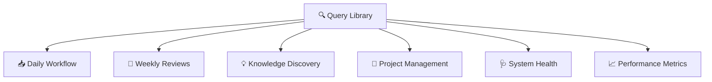

> [!orbit] Wayfinder | [[🗺️My PKM MOC]] | [[🏛️My PKM Governance]] | [[🔢My PKM Metadata]] | 🔍My PKM Queries |  [[📁My PKM Folders]] |  [[🏷️My PKM Tags]] |  [[🔁My PKM Workflows]] | [[✅My PKM Tasks]] | [[ℹ️My PKM Naming Convention]] 

# 🔍 PKM Queries Library

> [!info]+ **⚡ Queries Overview**
> **Purpose**: Comprehensive collection of Dataview and DataviewJS queries  
> **Philosophy**: Dynamic views bring static notes to life  
> **Organization**: By workflow stage and use case  
> **Maintenance**: Test and update queries quarterly

---
## 📊 Query Categories




---

## 📥 Daily Workflow Queries

### **1. Morning Dashboard** ☀️ Most Important

> [!warning] Flagged for review — this query was marked as not-working
> Verify syntax and test before using. Issues may be tag escaping or field names.

```dataview
TABLE WITHOUT ID
file.link AS "Today's Focus",
choice(
priority = "high", "🔴 Urgent"
) AS "Type"
FROM ""
WHERE (status = "📥inbox" AND priority = "high")
OR status = "🔄active"
SORT priority DESC
LIMIT 5

```

**Purpose**: Morning planning - what matters today  
**Review**: Every morning  
**Location**: Dashboard, Daily Note header

---

### **2. Inbox Processing** 📥 GTD Triage

```

TABLE WITHOUT ID
file.link AS "📥 To Process",
choice(created, date(created), date(file.ctime)) AS "Captured",
choice(
priority = "high", "🔴",
"⚪"
) AS "Priority"
FROM ""
WHERE status = "📥inbox" OR contains(tags, "#📥inbox")
SORT choice(created, created, file.ctime) ASC
LIMIT 10

```

**Purpose**: Daily inbox processing queue  
**Review**: Daily (10 minutes)  
**Action**: Process each item using GTD decision tree

---

### **3. High Priority Items** 🔴 Cross-Folder View

```

TABLE WITHOUT ID
file.link AS "High Priority",
file.folder AS "Folder",
choice(
status = "📥inbox", "📥",
choice(status = "🔄active", "🔄",
choice(status = "⏳waiting", "⏳", "📝")
)
) AS "Status"
FROM ""
WHERE priority = "high"
SORT file.folder, file.name

```

**Purpose**: All urgent work in one view  
**Review**: Multiple times daily  
**Action**: Prioritize and execute

---

### **4. Today's Tasks** ✅ Action List

```

not done
(due today) OR (scheduled today)
sort by priority desc, due
limit 10

```

**Purpose**: Task execution focus  
**Review**: Throughout the day  
**Action**: Check off as completed

---

### **5. Evening Review** 🌙 Reflection

```

LIST
FROM ""
WHERE contains(tags, "#🧹tidy") OR contains(tags, "#❔question")
SORT modified DESC
LIMIT 10

```

**Purpose**: Identify items needing attention  
**Review**: Every evening  
**Action**: Quick cleanup or research queue

---

### **6. Completed Today** ✅ Wins Tracking

```

TABLE WITHOUT ID
file.link AS "Completed Today",
choice(
contains(tags, "#🚀effort"), "🚀 Project",
choice(contains(tags, "#💡atomic"), "💡 Idea", "📚 Other")
) AS "Type"
FROM ""
WHERE (status = "✅completed" OR contains(tags, "#✅completed"))
AND choice(modified, modified, file.mtime) >= date(today)
SORT choice(modified, modified, file.mtime) DESC

```

**Purpose**: Celebrate daily wins  
**Review**: End of day  
**Action**: Acknowledge progress

---

## 📅 Weekly Review Queries

### **7. Completed This Week** 📦 Archive Candidates

```

LIST
WHERE status = "✅completed"
AND modified >= date(today) - dur(7 days)
GROUP BY file.folder

```

**Purpose**: Weekly accomplishment review  
**Review**: Sunday evening or Monday morning  
**Action**: Archive completed work

---

### **8. Stagnant Projects** ⏱️ Stuck Work

```

TABLE status, modified as "Last Activity"
FROM "03-Efforts"
WHERE status = "🔄active"
AND modified < date(today) - dur(14 days)
SORT modified ASC

```

**Purpose**: Identify abandoned projects  
**Review**: Weekly review  
**Action**: Restart, delegate, or archive

---

### **9. Active Projects Overview** 🚀 Portfolio View

```

TABLE status, modified as "Last Update"
FROM "03-Efforts"
WHERE status = "🔄active"
SORT modified DESC

```

**Purpose**: All active work at a glance  
**Review**: Weekly planning  
**Action**: Update statuses and next actions

---

### **10. Development Pipeline** 🌱 Knowledge Growth

```

TABLE WITHOUT ID
file.link as "Developing",
tags as "Stage",
modified as "Last Edit"
WHERE contains(tags, "#🌱develop")
OR contains(tags, "#❔question")
OR contains(tags, "#🧹tidy")
SORT modified ASC
LIMIT 15

```

**Purpose**: Track knowledge items needing attention  
**Review**: Weekly  
**Action**: Develop, research, or clean up

---

## 💡 Knowledge Discovery Queries

### **11. Recent Dots** 📤 New Knowledge

```

TABLE date(file.mtime) AS Updated, maturity
FROM "02-Knowledge"
WHERE (type = "atomic" OR contains(tags, "#💡atomic"))
SORT file.mtime DESC
LIMIT 10

```

**Purpose**: Track recently created/edited atomics  
**Review**: Weekly  
**Action**: Connect and develop

---

### **12. Maturity Distribution** 🌱 Growth Pipeline

```

TABLE WITHOUT ID
maturity AS "Stage",
length(rows) AS "Count",
rows.file.link AS "Notes"
FROM "02-Knowledge"
WHERE maturity
GROUP BY maturity
SORT length(rows) DESC

```

**Purpose**: Visualize knowledge maturity stages  
**Review**: Monthly  
**Action**: Promote mature notes

---

### **13. Top Topics** 🏷️ Theme Clusters

```

TABLE WITHOUT ID
topic AS "Topic",
length(rows) AS "Count",
rows.file.link AS "Notes"
FROM "02-Knowledge"
WHERE topic
GROUP BY topic
SORT length(rows) DESC
LIMIT 20

```

**Purpose**: Identify major knowledge themes  
**Review**: Monthly  
**Action**: Create MOCs for large clusters

---

### **14. Most Linked Notes** 🔗 Knowledge Hubs

```

LIST length(file.inlinks)
FROM ""
WHERE !contains(file.path, "06-Archive")
SORT length(file.inlinks) DESC
LIMIT 10

```

**Purpose**: Discover hub notes and MOC candidates  
**Review**: Monthly  
**Action**: Strengthen hub notes, create MOCs

---

### **15. Random Dot for Connection** 🎲 Serendipity

```

const dots = dv.pages('"02-Knowledge"')
.where(p => p.type === "atomic");
const random = dots[Math.floor(Math.random() * dots.length)];
dv.paragraph(`🎲 **Random Dot:** ${dv.fileLink(random.file.path)}`);
dv.paragraph(`**Maturity:** ${random.maturity || "Unknown"}`);
dv.paragraph(`**Topics:** ${random.tags?.join(", ") || "None"}`);

```

**Purpose**: Serendipitous knowledge connection  
**Review**: Daily or weekly  
**Action**: Find 2-3 connections

---

## 📚 Sources & Reading Queries

### **16. Reading Queue** 📖 To-Read List

```

LIST
FROM "04-Sources"
WHERE contains(tags, "#status/unread")
SORT priority DESC, created ASC

```

**Purpose**: Prioritized reading list  
**Review**: Weekly  
**Action**: Schedule reading time

---

### **17. Recently Completed Sources** ✅ Processed Content

```

LIST
FROM "04-Sources"
WHERE read_status = "completed"
AND file.mtime >= date(today) - dur(30 days)
SORT file.mtime DESC

```

**Purpose**: Track reading progress  
**Review**: Monthly  
**Action**: Extract key insights to atomics

---

### **18. Sources by Status** 📊 Reading Pipeline

```

TABLE WITHOUT ID
file.link AS "Source",
source_author AS "Author",
choice(
read_status = "completed", "✅ Processed",
choice(read_status = "reading", "📖 Reading", "📥 Queue")
) AS "Status"
FROM "04-Sources"
WHERE type = "source" OR contains(tags, "#📚source")
SORT choice(created, created, file.ctime) DESC

```

**Purpose**: Full reading pipeline view  
**Review**: Weekly  
**Action**: Move through stages

---

## 🩺 System Health Queries

### **19. Missing Metadata** ⚠️ Quality Check

```

TABLE WITHOUT ID
file.link as "Note",
!status as "❌ Missing status",
!type as "❌ Missing type",
!tags as "❌ Missing tags"
FROM ""
WHERE !status OR !type OR !tags
SORT file.name ASC
LIMIT 10

```

**Purpose**: Identify incomplete metadata  
**Review**: Monthly  
**Action**: Fill in missing fields

---

### **20. Orphan Notes** 🏝️ Disconnected Items

```

LIST
FROM ""
WHERE length(file.inlinks) = 0 AND length(file.outlinks) = 0
AND !contains(file.path, "Templates")
AND !contains(file.folder, "99-System")
AND !contains(file.folder, "06-Archive")
SORT file.name
LIMIT 10

```

**Purpose**: Find isolated notes  
**Review**: Monthly  
**Action**: Connect or delete

---

### **21. Unresolved Links** 🔗 Missing Pages

```

const unresolvedLinksMap = app.metadataCache.unresolvedLinks;
const res = {};
for (let page in unresolvedLinksMap) {
const unresolved = Object.keys(unresolvedLinksMap[page]);
if (unresolved.length === 0) continue;
for (let link of unresolved) {
if (!res[link]) res[link] = { link, usages: [] };
res[link].usages.push(dv.fileLink(page));
}
}
const rows = Object.values(res)
.map(l => [dv.fileLink(l.link), l.usages.join(' · '), l.usages.length])
.sort((a, b) => b - a);
dv.table(["Missing Page", "Referenced In", "Count"], rows);

```

**Purpose**: Identify most-referenced missing notes  
**Review**: Monthly  
**Action**: Create high-count missing pages

---

### **22. Recent Changes** 🆕 Activity Log

```

LIST FROM ""
WHERE file.mtime >= date(today) - dur(14 days)
SORT file.mtime DESC
LIMIT 10

```

**Purpose**: Track vault activity  
**Review**: Weekly  
**Action**: Ensure active work is progressing

---

### **23. Effort Metadata Gaps** 🚀 Type Validation

```
TABLE WITHOUT ID
file.link as "Effort",
default(priority, "❌ missing") as "Priority",
default(due, "—") as "Due",
default(completion_percentage, "—") as "Progress"
FROM "03-Efforts"
WHERE type = "effort"
AND (!priority OR !status OR !created)
SORT file.name ASC

```

**Purpose**: Find effort notes missing required fields (priority is required per schema)
**Review**: Monthly
**Action**: Fill priority + any other missing fields

---

### **24. Atomic Metadata Gaps** 💡 Type Validation

```

TABLE WITHOUT ID
file.link as "Atomic",
default(maturity, "❌ missing") as "Maturity",
default(status, "❌ missing") as "Status",
length(file.tags) as "Tags"
FROM "02-Knowledge"
WHERE type = "atomic"
AND (!tags OR length(file.tags) = 0 OR !status)
SORT file.name ASC

```

**Purpose**: Find atomic notes missing tags (required) or status
**Review**: Monthly
**Action**: Add tags and status

---

### **25. Source Metadata Gaps** 📚 Type Validation

```

TABLE WITHOUT ID
file.link as "Source",
default(source_type, "❌ missing") as "Source Type",
default(read_status, "❌ missing") as "Read Status",
default(rating_type, "—") as "Rating Type"
FROM "04-Sources"
WHERE type = "source"
AND (!source_type OR !read_status)
SORT file.name ASC

```

**Purpose**: Find sources missing source_type or read_status (optional but recommended)
**Review**: Monthly
**Action**: Classify source type and reading status

---

### **26. Meeting Metadata Gaps** 🤝 Type Validation

```

TABLE WITHOUT ID
file.link as "Meeting",
default(meeting_type, "❌ missing") as "Type",
default(participants, "❌ missing") as "Participants",
default(status, "❌ missing") as "Status"
FROM "04-Sources/Meetings"
WHERE type = "meeting"
AND (!meeting_type OR !participants OR !status)
SORT file.name ASC

```

**Purpose**: Find meetings missing type, participants, or status
**Review**: Monthly
**Action**: Fill meeting context fields

---

### **27. Person Metadata Gaps** 👤 Type Validation

```

TABLE WITHOUT ID
file.link as "Person",
default(org, "❌ missing") as "Org",
default(status, "❌ missing") as "Status"
FROM "02-Knowledge/People"
WHERE type = "person"
AND (!org OR !status)
SORT file.name ASC

```

**Purpose**: Find person notes missing relationship classification
**Review**: Quarterly
**Action**: Classify relationship type

---

## 📈 Performance Metrics Queries

### **28. Vault Growth Rate** 📶 Capture Velocity

```

const all = dv.pages();
const last7 = all.where(p =>
p.file.ctime >= window.moment().subtract(7, 'days')
);
dv.paragraph(
"**Average growth:** " +
(last7.length / 7).toFixed(1) +
" notes/day"
);

```

**Purpose**: Monitor capture rate  
**Review**: Weekly  
**Action**: Adjust if too low or too high

---

### **29. Tag Coverage** 🏷️ Metadata Quality

```

const pages = dv.pages("");
const taggedCount = pages.filter(p =>
p.file.tags?.length > 0
).length;
const totalCount = pages.length;
const pct = ((taggedCount / totalCount) * 100).toFixed(1);
dv.table(
["Metric", "% Notes with Tags"],
[["Tag Coverage", `${pct}%`]]
);

```

**Purpose**: Measure tagging consistency  
**Review**: Monthly  
**Action**: Tag untagged notes

---

### **30. Weekly Productivity Dashboard** 📊 GTD Metrics

```

const weeklyStats = {
inbox: dv.pages('"+Inbox"')
.where(p => p.status === "📥inbox").length,
active: dv.pages('"03-Efforts"')
.where(p => p.status === "🔄active").length,
completed: dv.pages()
.where(p => p.status === "✅completed" &&
p.modified >= dv.date("today - 7 days")).length
};

dv.paragraph(`
**📈 Weekly Overview:**

- 📥 In Inbox: \${weeklyStats.inbox}
- 🔄 Active Projects: \${weeklyStats.active}
- ✅ Completed This Week: \${weeklyStats.completed}
`);

```

**Purpose**: Weekly performance snapshot  
**Review**: Sunday evening  
**Action**: Adjust workflows if needed

---

### **31. Task Completion Rate** ✅ Execution Tracking

```

TABLE WITHOUT ID
dateformat(date(today) - dur(6 days), "dd.MM") + " - " +
dateformat(date(today), "dd.MM") as "Period",
length(filter(rows.file.tasks,
(t) => t.completed AND
t.completion >= date(today) - dur(7 days)
)) as "✅ Completed",
length(filter(rows.file.tasks,
(t) => t.created >= date(today) - dur(7 days)
)) as "📝 Created",
round(
length(filter(rows.file.tasks,
(t) => t.completed AND
t.completion >= date(today) - dur(7 days)
)) /
length(filter(rows.file.tasks,
(t) => t.created >= date(today) - dur(7 days)
)) * 100, 1
) + "%" as "📊 Completion Rate"
FROM ""
WHERE file.tasks
GROUP BY true

```

**Purpose**: Measure task execution effectiveness  
**Review**: Weekly  
**Action**: Improve if below 70%

---

### **32. Project Task Breakdown** 📊 Effort Analytics

```

TABLE WITHOUT ID
file.link as "Project",
length(rows) as "Task Count",
length(filter(rows.file.tasks, (t) => t.completed)) as "✅ Done",
length(filter(rows.file.tasks, (t) => !t.completed)) as "🔄 Active"
FROM "03-Efforts"
WHERE type = "effort"
GROUP BY file.link
SORT length(rows.file.tasks) DESC

```

**Purpose**: Project progress tracking  
**Review**: Weekly  
**Action**: Focus on low-completion projects

---

## 🎯 Context-Based Queries

### **33. High Energy Work** ⚡ Peak Performance — RETIRED (2026-07-27)

> [!warning] Query retired
> Used `#context/computer` and `#energy/high` tags, both retired from `CIS_TAG.md` (closed small sets, no active workflow used them — see "Namespaces retired" in `CIS_TAG.md`). Live context-filtering now uses the Tasks plugin's `@computer`/`@home`/etc. syntax (see `TODO.md` → "Next Actions by Context"), which never depended on this tag. No equivalent replacement for "high energy" filtering exists — if that need resurfaces, use a Tasks-plugin `@` context or a real YAML field, not a revived tag.

**Purpose**: Deep work task list  
**Review**: Morning (high energy period)  
**Action**: Execute during peak hours

---

### **34. Quick Wins** ⚡ Low Energy Tasks

```

TASK
WHERE contains(tags, "#quick-win")
AND !completed
SORT priority DESC
LIMIT 10

```

**Purpose**: Filler tasks for low energy  
**Review**: Throughout the day  
**Action**: Complete during energy dips

---

### **35. Errands Batch** 🚗 Location-Based — RETIRED (2026-07-27)

> [!warning] Query retired
> Used `#context/errands`, retired from `CIS_TAG.md`. Use the Tasks plugin's `@errands` context instead (already live in `TODO.md` → "Next Actions by Context"), e.g. `not done` + `description includes @errands`.

**Purpose**: Batch errands efficiently  
**Review**: Before leaving home  
**Action**: Plan errand route

---

## 🔧 Inline Query Examples

### **Count Notes in Folder**

```

`$=dv.pages('"02-Knowledge"').length`

```

**Output**: Total note count  
**Use**: MOC headers, folder statistics

---

### **List Folder Contents**

```

`$=dv.pages('"03-Efforts"').file.name`

```

**Output**: Comma-separated file names  
**Use**: Quick folder overview

---

### **Backlinks to Current Note**

```

const here = dv.current();
const uniq = a => [...new Set(a)];
const links = uniq([
...(here.file.outlinks ?? []),
...(here.file.inlinks ?? [])
].map(x => x.path));
dv.list(links.map(p => dv.fileLink(p)));

```

**Output**: All connected notes  
**Use**: Note context exploration

---

### **Uncompleted Tasks Around This Note**

```

TASK
FROM ""
WHERE !completed AND (
contains(file.inlinks, this.file.link) OR
contains(file.outlinks, this.file.link)
)
SORT due ASC

```

**Output**: Related open tasks  
**Use**: Note-level task management

---

## 📋 Query Best Practices

### **Do's ✅**

- ✅ Test queries before adding to dashboard
- ✅ Use `LIMIT` to prevent performance issues
- ✅ Add comments explaining complex queries
- ✅ Use consistent field names (metadata standards)
- ✅ Group related queries in sections
- ✅ Include PURPOSE and REVIEW frequency
- ✅ Optimize DataviewJS for large vaults

### **Don'ts ❌**

- ❌ Create queries without clear purpose
- ❌ Use queries on folders that don't exist
- ❌ Ignore query performance (slow = bad UX)
- ❌ Duplicate queries across multiple notes
- ❌ Use inconsistent metadata (breaks queries)
- ❌ Create overly complex nested queries
- ❌ Forget to update queries when metadata changes

---

## 🛠️ Query Optimization Tips

### **Performance Optimization**

1. **Limit Results**: Always use `LIMIT` for large queries
2. **Folder Filtering**: Use `FROM "folder"` to narrow scope
3. **Avoid Complex Nested Logic**: Simplify WHERE clauses
4. **Cache Results**: Use DataviewJS for expensive calculations
5. **Index Fields**: Use metadata fields over full-text search

### **Debugging Queries**

```

// Debug mode - shows raw data
const pages = dv.pages('"02-Knowledge"');
dv.table(
["File", "Status", "Type", "Tags"],
pages.map(p => [
p.file.link,
p.status,
p.type,
p.file.tags?.join(", ")
])
);

```

---

## 🔗 Related System Notes

- [[👁️Dashboard]] - Where queries are displayed
- [[🔁My PKM Workflows]] - How queries enable workflows
- [[🔢My PKM Metadata]] - Field names used in queries
- [[🏷️My PKM Tags]] - Tag-based query filtering
- [[✅My PKM Tasks]] - Task query examples

---

> [!quote]+ **💭 Query Philosophy**
> *"Queries turn your vault from a static archive into a living, breathing knowledge system. They surface insights, track progress, and maintain system health. Write queries with purpose, test regularly, and optimize for speed."*

---

*Last Updated: 2025-10-01 | Review: Quarterly | Total Queries: 35*

⬆️ [[🏡Home]]  *| `= this.file.mtime`*
