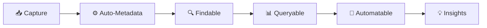
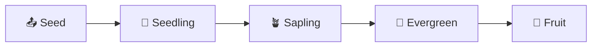

> [!orbit] Wayfinder | [[🗺️My PKM MOC]] | [[🏛️My PKM Governance]] | 🔢My PKM Metadata | [[🔍My PKM Queries]] |  [[📁My PKM Folders]] |  [[🏷️My PKM Tags]] |  [[🔁My PKM Workflows]] | [[✅My PKM Tasks]] | [[ℹ️My PKM Naming Convention]]

> [!SUMMARY]- Table of Contents
> - [📊 PKM Metadata Standards](🔢My%20PKM%20Metadata.md#📊%20PKM%20Metadata%20Standards)
>     - [🎯 Metadata Philosophy](🔢My%20PKM%20Metadata.md#🎯%20Metadata%20Philosophy)
>         - [**Core Principles**](🔢My%20PKM%20Metadata.md#**Core%20Principles**)
>     - [📊 Universal Metadata Schema](🔢My%20PKM%20Metadata.md#📊%20Universal%20Metadata%20Schema)
>     - [🔢 Ordered Metadata](🔢My%20PKM%20Metadata.md#🔢%20Ordered%20Metadata)
>         - [**This is the order** in base script: CLICK TO SEE MORE ](🔢My%20PKM%20Metadata.md#**This%20is%20the%20order**%20in%20base%20script:%20CLICK%20TO%20SEE%20MORE%20)
>     - [🗂️ Type-Specific Metadata Extensions](🔢My%20PKM%20Metadata.md#🗂️%20Type-Specific%20Metadata%20Extensions)
>         - [**📥 [[+Inbox]] — Capture Metadata**](🔢My%20PKM%20Metadata.md#**📥%20[[+Inbox]]%20—%20Capture%20Metadata**)
>         - [**🗺️ [[01-MOCs]] — Map Metadata**](🔢My%20PKM%20Metadata.md#**🗺️%20[[01-MOCs]]%20—%20Map%20Metadata**)
>         - [**💡 [[02-Knowledge]] — Atomic Metadata**](🔢My%20PKM%20Metadata.md#**💡%20[[02-Knowledge]]%20—%20Atomic%20Metadata**)
>         - [**🚀 [[03-Efforts]] — Project Metadata**](🔢My%20PKM%20Metadata.md#**🚀%20[[03-Efforts]]%20—%20Project%20Metadata**)
>         - [**📚 04-Sources — Reference Metadata**](🔢My%20PKM%20Metadata.md#**📚%2004-Sources%20—%20Reference%20Metadata**)
>         - [**📅 04-01-Meetings — Meeting Metadata**](🔢My%20PKM%20Metadata.md#**📅%2004-01-Meetings%20—%20Meeting%20Metadata**)
>         - [**👥 [[People]] — Person Metadata**](🔢My%20PKM%20Metadata.md#**👥%20[[People]]%20—%20Person%20Metadata**)
>         - [**🛠️ [[Tools]] — Tool Metadata**](🔢My%20PKM%20Metadata.md#**🛠️%20[[Tools]]%20—%20Tool%20Metadata**)
>         - [**📍 [[Places]] — Location Metadata**](🔢My%20PKM%20Metadata.md#**📍%20[[Places]]%20—%20Location%20Metadata**)
>         - [**📅 [[05-Calendar]] — Temporal Metadata**](🔢My%20PKM%20Metadata.md#**📅%20[[05-Calendar]]%20—%20Temporal%20Metadata**)
>         - [**📦 06-Archive — Archive Metadata**](🔢My%20PKM%20Metadata.md#**📦%2006-Archive%20—%20Archive%20Metadata**)
>     - [🎯 Specialized Metadata Systems](🔢My%20PKM%20Metadata.md#🎯%20Specialized%20Metadata%20Systems)
>         - [**🌱 Maturity Tracking System**](🔢My%20PKM%20Metadata.md#**🌱%20Maturity%20Tracking%20System**)
>         - [**⚡ Energy & Context System** (GTD-Inspired)](🔢My%20PKM%20Metadata.md#**⚡%20Energy%20&%20Context%20System**%20(GTD-Inspired))
>         - [**🎯 Priority Matrix** (Eisenhower Method)](🔢My%20PKM%20Metadata.md#**🎯%20Priority%20Matrix**%20(Eisenhower%20Method))
>     - [🤖 Automation Integration](🔢My%20PKM%20Metadata.md#🤖%20Automation%20Integration)
>         - [**Dataview Query Examples**](🔢My%20PKM%20Metadata.md#**Dataview%20Query%20Examples**)
>     - [🩺 Metadata Health Monitoring](🔢My%20PKM%20Metadata.md#🩺%20Metadata%20Health%20Monitoring)
>         - [**Missing Metadata Query**](🔢My%20PKM%20Metadata.md#**Missing%20Metadata%20Query**)
>         - [**Metadata Completeness Score**](🔢My%20PKM%20Metadata.md#**Metadata%20Completeness%20Score**)
>     - [📋 Metadata Best Practices](🔢My%20PKM%20Metadata.md#📋%20Metadata%20Best%20Practices)
>         - [**Do's ✅**](🔢My%20PKM%20Metadata.md#**Do's%20✅**)
>         - [**Don'ts ❌**](🔢My%20PKM%20Metadata.md#**Don'ts%20❌**)
>     - [🔄 Metadata Evolution Process](🔢My%20PKM%20Metadata.md#🔄%20Metadata%20Evolution%20Process)
>         - [**Quarterly Metadata Review**](🔢My%20PKM%20Metadata.md#**Quarterly%20Metadata%20Review**)
>     - [🔗 Related System Notes](🔢My%20PKM%20Metadata.md#🔗%20Related%20System%20Notes)
>     - [🛡️ Metadata Validation & Automation Tools (v2.0)](🔢My%20PKM%20Metadata.md#🛡️%20Metadata%20Validation%20&%20Automation%20Tools%20(v2.0))
>         - [YAML Validator (`yaml_validator.js`)](🔢My%20PKM%20Metadata.md#YAML%20Validator%20(`yaml_validator.js`))
>         - [Maturity Promoter (`maturity-promoter.js`)](🔢My%20PKM%20Metadata.md#Maturity%20Promoter%20(`maturity-promoter.js`))
>         - [Enum drift guard (`AIOS/scripts/check-enum-drift.py`)](🔢My%20PKM%20Metadata.md#Enum%20drift%20guard%20(`AIOS/scripts/check-enum-drift.py`))
>         - [Status & Maturity Pickers](🔢My%20PKM%20Metadata.md#Status%20&%20Maturity%20Pickers)
>         - [Weekly Report Generator (`generate-weekly-report.js`)](🔢My%20PKM%20Metadata.md#Weekly%20Report%20Generator%20(`generate-weekly-report.js`))
>         - [Query Templates (`Templates/Queries/`)](🔢My%20PKM%20Metadata.md#Query%20Templates%20(`Templates/Queries/`))
>         - [YAML Orchestrator Auto-Tidy](🔢My%20PKM%20Metadata.md#YAML%20Orchestrator%20Auto-Tidy)
>     - [**Key Features:**](🔢My%20PKM%20Metadata.md#**Key%20Features:**)
>         - [**📊 Complete Coverage**](🔢My%20PKM%20Metadata.md#**📊%20Complete%20Coverage**)
>         - [**🎨 Visual Excellence**](🔢My%20PKM%20Metadata.md#**🎨%20Visual%20Excellence**)
>         - [**🤖 Practical Automation**](🔢My%20PKM%20Metadata.md#**🤖%20Practical%20Automation**)
>         - [**🎯 Actionable Structure**](🔢My%20PKM%20Metadata.md#**🎯%20Actionable%20Structure**)

# 📊 PKM Metadata Standards

> [!info]+ **⚡ Metadata Overview**
> **Purpose**: Consistent data structure for findability, automation, and insights  
> **Philosophy**: Minimal overhead, maximum utility  
> **Automation**: Templater + Dataview + QuickAdd  
> **Maintenance**: Quarterly review and optimization

---

## 🎯 Metadata Philosophy




---

### **Core Principles**

> [!success]+ **Metadata Best Practices**
> - ✅ **Consistency** - Always use same format and naming conventions
> - ✅ **Minimal Overhead** - Only metadata you actually use
> - ✅ **Automation First** - Templater and QuickAdd reduce manual effort
> - ✅ **Evolution Ready** - Schema adapts with workflow needs
> - ✅ **Integration** - Connected with tags, folders, and queries

---

## 📊 Universal Metadata Schema

### [[base]] YAML Properties (All Notes) 
>*Dublin Core inspired*

```
title: for query
type: atomic|effort|source|moc|meeting|prompt|person|place|tool|area|system|dashboard|about|guide|tutorial|daily|weekly|monthly|quarterly|yearly|challenge|archive
status: 📥inbox|🔄active|⏳waiting|✅completed|📦archived|⏸️paused|❌cancelled|⚠️blocked
tags: 
created: YYYY-MM-DD
modified: YYYY-MM-DD
related: 
- "[[]]"
fileClass: base|atomic|effort|source|moc|meeting|prompt|archive
```

## 🔢 Ordered Metadata
> Using yaml_reorder metadata will be ordered. Use this command: 

[[Guide - YAML Orchestrator|Read more]]
```
<%* tp.user.yaml_reorder(tp) %>
```
### **This is the order** in base script: CLICK TO SEE MORE 
```
  const baseOrder = [
  // Navigation
"up",    
"in",
  // Identity
"title",
"aliases",
"type",
"fileClass",
"cssclass",
"tags",

  // State
"status",
"maturity",
"priority",
"processing_priority",
"completeness",
"coverage_areas",
"action_required",

  // Time & Scheduling
"created",
"modified",
"start",
"due",  // ⚠️ Standardized: use "due" instead of "deadline" (auto-renamed by YAML Orchestrator)
"end",
"last_review",
"review_frequency", 
"estimated_effort",

// Actions & Progress
"completion_percentage",
"next_actions",
"capture_method",
"linked_notes_count",

// Knowledge & Quality
"confidence_level", 
"evidence_quality",
"read_status",
"rating_type",

// Source & External
"source_author",
"source_date", 
"source_type",

// Context & Collaboration
"participants",
"location", 
"meeting_type",
"action_items",

// Specialized (AI/Prompts)
"audience",
"difficulty", 
"prompt_category",
"prompt_type",

// Relations (stay at end)
"related",
"see_also",
"related_concepts",
"related_ideas",

// People (future-proofing)
"role",
"org", 
"company",
"email",
"phone",
"website",
"twitter",
"github", 
"linkedin"
  ];
```

---

## 🗂️ Type-Specific Metadata Extensions

### **📥 [[+Inbox]] — Capture Metadata**

> [!SEED]+ **Purpose**
> Quick triage and prioritization during daily processing  
> **Automation**: Templater auto-fills capture context

```
title: "Quick Capture Item"
type: atomic
status: 📥inbox
created: 2025-06-08
tags: [\#📥inbox]
processing_priority: [urgent|normal|low]
estimated_effort: [<5min|5-15min|15-30min|>30min]
```

**Capture Method Values**:
- `quickadd` - QuickAdd macro capture
- `manual` - Direct file creation
- `mobile` - Obsidian mobile app
- `voice` - Voice memo transcription
- `web` - Web clipper or highlight

---

### **🗺️ [[01-MOCs]] — Map Metadata**

> [!map]+ **Purpose**
> Track topic coverage and navigation effectiveness  
> **Automation**: Dataview counts linked notes automatically

```
title: "MOC - Topic Name"
type: moc
tags: 
- 🗺️MOC,
- topic-name
created: 2025-09-30
modified: 2025-09-30
coverage_areas:
- "Subtopic 1"
- "Subtopic 2"
- "Subtopic 3"
last_review: 2025-09-30
review_frequency: weekly|monthly|quarterly
completeness: draft|partial|comprehensive
related:
- "[[Related MOC]]"
- "[[Parent Area]]"
fileClass: MOC
```

---

### **💡 [[02-Knowledge]] — Atomic Metadata**

> [!atom]+ **Purpose**
> Track idea development from seed to evergreen  
> **Automation**: Maturity tracking for knowledge growth

```
title: "Atomic Concept"
type: atomic
status: 🔄active
tags: 
-💡atomic
- topic-name
created: 2025-09-30
modified: 2025-09-30
maturity: 📤seed|🌱seedling|🪴sapling|🌲evergreen|🍓fruit
domain: psychology|tech|business|health|finance
source_inspiration: "[[Source Note]]"
confidence_level: high|medium|low|uncertain
evidence_quality: strong|moderate|weak|anecdotal
related:
- "[[Related Concept 1]]"
- "[[Related Concept 2]]"
fileClass: atomic
```

**Maturity Progression**:

| Stage         | Icon | Description                       | Exit Criteria                        |
| ------------- | ---- | --------------------------------- | ------------------------------------ |
| **Seed**      | 📤   | Raw capture, minimal context      | Basic metadata + folder move         |
| **Seedling**  | 🌱   | Early development, some links     | 2+ links, structured content         |
| **Sapling**   | 🪴   | Growing content, rich connections | 5+ links, 2+ backlinks               |
| **Evergreen** | 🌲   | Stable, foundational knowledge    | Frequently referenced, comprehensive |
| **Fruit**     | 🍓   | Original insight, external value  | Published, actionable output         |

---

### **🚀 [[03-Efforts]] — Project Metadata**

> [!rocket]+ **Purpose**
> Project tracking and progress management  
> **Automation**: Weekly review updates project status

```
title: "Project Name"
type: effort
status: 🔄active
tags: 
-🚀effort
-domain-name
created: 2025-09-30
modified: 2025-09-30
project_status: active|paused|completed|archived
effort_type: experiment|learning|building|shipping
priority: high|medium|low
rank: 5
energy: high|medium|low
context: work|home|computer|calls|errands
due: 2025-12-31
completion_percentage: 25
next_actions: "Specific next step"
blockers:
- "Blocker 1"
- "Blocker 2"
related:
- "[[Related Effort]]"
- "[[Supporting Area]]"
fileClass: effort
```

> [!note]+ **`rank` vs `priority`**
> `priority` is categorical (effort class). `rank` is ordinal, 1–10, and drives the Dashboard Focus section's weekly sort order:
> - 1–3 = backlog
> - 4–6 = steady
> - 7–10 = this week / urgent
>
> Update `rank` weekly based on current focus — it's not a replacement for `priority`, both coexist.

**GTD-Enhanced Fields**:

```
action_required: true|false
waiting_for: "Person/Event/Date"
time_required: <5min|5-15min|15-30min|>30min
delegated_to: "Person Name"
someday_maybe: false
```

**v2 optional fields** (added 2026-07-24 — live in `99-System/FileClass/effort.md`, `Templates/Meta/effort-meta.yaml.md`, `yaml_validator.js`):

```
objectives:
- "Objective 1"
deliverables:
- "Deliverable 1"
budget: 0
spent: 0
```

---

### **📚 04-Sources — Reference Metadata**

> [!book]+ **Purpose**
> Track reading progress and source quality  
> **Automation**: Key insights count from linked atomics

```
***
title: "Book/Article/Video Title"
type: documentation
status: 🔄active
tags: 
- 📚source
- domain-name
created: 2025-09-30
modified: 2025-09-30
source_type: book|article|video|podcast|course|paper
source_author: "Author Name"
source_url: "https://example.com"
source_date: 2025-01-01
read_status: unread|reading|completed|reference
isbn: "978-xxx-xxx"
rating: 1|2|3|4|5
notes_extracted: 10
related:
- "[[Related Source]]"
- "[[Topic MOC]]"
fileClass: source
***
```

**Source Type Specific**:
- **Books**: `isbn`, `publisher`, `pages`, `audiobook_length`
- **Articles**: `publication`, `word_count`
- **Videos**: `platform`, `duration`, `channel`
- **Podcasts**: `episode_number`, `series`, `duration`

---

### **📅 04-01-Meetings — Meeting Metadata**

> [!calendar]+ **Purpose**
> Track meeting outcomes and action items  
> **Automation**: Action items extracted to task list

#🧹tidy - validate the metadata + folder is not in place
```
***
title: "Meeting - Topic"
type: meeting
status: ✅completed
tags: 
- 🤝meeting
created: 2025-09-30
modified: 2025-09-30
meeting_date: 2025-09-30
meeting_time: "14:00"
duration: 60min
participants:
- "[[Person 1]]"
- "[[Person 2]]"
meeting_type: standup|planning|review|retrospective|1-on-1
location: office|remote|hybrid
recording_link: "https://..."
action_items:
- "[ ] Action 1 @person1"
- "[ ] Action 2 @person2"
decisions_made:
- "Decision 1"
- "Decision 2"
related:
- "[[Project]]"
- "[[Previous Meeting]]"
fileClass: meeting
***
```

**v2 optional fields** (added 2026-07-24 — live in `99-System/FileClass/meeting.md`, `Templates/Meta/meeting-meta.yaml.md`, `yaml_validator.js`):

```
duration: 60min
recording_link: "https://..."
next_meeting: 2025-10-07
```

---

### **👥 [[People]] — Person Metadata**

> [!user]+ **Purpose**
> Relationship intelligence and context  
> **Automation**: Last interaction from meeting notes

```
***
title: "Person Name"
type: person
status: 🔄active
tags: 
- 👥person
- relationship-type
created: 2025-09-30
modified: 2025-09-30
relationship: colleague|mentor|friend|family|client
context: work|personal|community
contact_method: email|phone|slack|linkedin
last_interaction: 2025-09-30
interaction_frequency: daily|weekly|monthly|quarterly
areas_of_expertise:
- "Skill 1"
- "Skill 2"
shared_interests:
- "Interest 1"
- "Interest 2"
related:
- "[[Meetings]]"
- "[[Projects Together]]"
fileClass: person
***
```

---

### **🛠️ [[Tools]] — Tool Metadata**

> [!wrench]+ **Purpose**
> Capability enhancement and tool mastery tracking  
> **Automation**: Usage frequency from log

```
***
title: "Tool Name"
type: tool
status: 🔄active
tags: [\#🛠️tool, \#category]
created: 2025-09-30
modified: 2025-09-30
tool_category: software|hardware|methodology|framework
tool_type: productivity|creative|analysis|health
rating: 1|2|3|4|5
mastery_level: beginner|intermediate|advanced|expert
usage_frequency: daily|weekly|monthly|rarely
cost: free|one-time|subscription
platform: windows|mac|linux|ios|android|web|cross-platform
last_used: 2025-09-30
roi_score: high|medium|low
related:
- "[[Related Tool]]"
- "[[Area Using Tool]]"
fileClass: tool
***
```

**v2 optional fields** (added 2026-07-24 — live in `99-System/FileClass/Tool.md` (created this round), `Templates/Meta/tool-meta.yaml.md`, `yaml_validator.js`):

```
version: "1.7.7"
date_first_used: 2025-08-01
license: "proprietary (free for personal use)"
price_model: freemium
alternatives:
- "[[Alternative Tool]]"
integrations:
- "[[Integrated Tool]]"
key_features:
- "Feature 1"
use_cases:
- "Use case 1"
pros:
- "Pro 1"
cons:
- "Con 1"
```

> [!note]- Parked types
> The equivalent v2 field sets for **Concept, Idea, Course, Book, Article, Research** are **not** propagated — they're blocked on the shared-FileClass question (`atomic` covers Concept+Idea; `source` covers Course/Book/Article/Research, and metadata-menu has no conditional fields). See `AIOS/docs/plans/2026-07-23-shared-fileclass-field-conflict-decision.md`.

---

### **📍 [[Places]] — Location Metadata**

> [!map-pin]+ **Purpose**
> Geographic intelligence and travel context  
> **Automation**: Visit count from calendar notes

```
***
title: "Place Name"
type: place
status: 🔄active
tags: [\#🗺️place, \#location-type]
created: 2025-09-30
modified: 2025-09-30
place_type: city|country|venue|landmark|restaurant
location_coordinates: "lat, long"
visit_status: wishlist|visited|frequent
visit_count: 5
last_visit: 2025-09-30
rating: 1|2|3|4|5
highlights:

- "Highlight 1"
- "Highlight 2"
recommendations:
- "Recommendation 1"
related:
- "[[Trip Notes]]"
- "[[People Met Here]]"
fileClass: place
***
```

---

### **📅 [[05-Calendar]] — Temporal Metadata**

#### **Daily Notes**
#🧹tidy - validate metadata and check fileClass
```
***
title: "2025-09-30 Monday"
type: daily
status: 🔄active
tags: 
-📅daily
date: 2025-09-30
week_number: 40
energy: high|medium|low
mood: 😊|😐|😔|😤
focus_area: [[Project Name]]
wins_today: 3
related:
- "[[2025-W40]]"
- "[[2025-09]]"
fileClass: daily
***
```

#### **Weekly Notes**
#🧹tidy - validate metadata and CREATE fileClass
```
***
title: "2025-W40"
type: weekly
status: ✅completed
tags: 
-📅weekly
week_start: 2025-09-28
week_end: 2025-10-04
theme: "Weekly Focus Theme"
wins: 5
challenges: 2
lessons_learned: 3
related:
- "[[2025-09]]"
- "[[Days of Week]]"
fileClass: weekly
***
```

---

### **📦 06-Archive — Archive Metadata**

> [!archive]+ **Purpose**
> Audit trail and retention management  
> **Automation**: Archive workflow adds metadata

#🧹tidy  - Think about. Because what will happen with the metadata from before? This is unncessary i think
```
***
title: "Archived Item"
type: [original-type]
status: 📦archived
tags: [\#📦archived, \#original-tags]
created: 2025-09-30
modified: 2025-09-30
archived_date: 2025-09-30
archive_reason: completed|obsolete|superseded|low-value|consolidated
original_location: "03-Efforts"
retention_period: 1-year|2-years|5-years|permanent
delete_after: 2027-09-30
outcome_summary: "What was achieved"
lessons_learned: "Key takeaways"
related:
- "[[Successor Note]]"
fileClass: archived
***
```

---

## Lightweight types — minimal YAML contract

Lightweight types (system, dashboard, about, guide, tutorial, daily, weekly, monthly, quarterly, yearly, challenge) have no FileClass and no body template. They must still carry this minimal YAML:

| Field | Required | Rule |
|---|---|---|
| `up` | yes | quoted wikilink to parent hub |
| `title` | yes | matches filename intent |
| `type` | yes | one of the 11 lightweight values in CIS_TYPE |
| `status` | yes | canonical emoji enum |
| `tags` | yes | ≥1 emoji-prefixed tag |
| `created` / `modified` | yes | YYYY-MM-DD |
| `maturity` | no | if present, canonical enum |

Anything beyond this is per-note optional. Body structure is free, except the two nav elements every note carries (wayfinder callout first, `⬆️ [[🏡Home]]` footer last).

*Decision 2026-07-08: system/dashboard stay lightweight — full types earn their cost only for template-created, field-queried notes; these are heterogeneous one-off infrastructure.*

---

## 🎯 Specialized Metadata Systems

### **🌱 Maturity Tracking System**
[[Maturity Evolve|Read here]]
> [!growth]+ **Knowledge Development Pipeline**
> Inspired by Nick Ang's growth philosophy



**Promotion Checklist**:

**📤 → 🌱 (Seed to Seedling)**
- [ ] Title is clear and descriptive
- [ ] Type assigned (atomic/effort/source)
- [ ] Basic tags applied
- [ ] Moved from Inbox to proper folder
- [ ] Content has structure (headers, paragraphs)
- [ ] At least 2 outbound links + 1 backlink

**🌱 → 🪴 (Seedling to Sapling)**
- [ ] 5+ internal links (outbound)
- [ ] 2+ backlinks (inbound references)
- [ ] Content is comprehensive and complete
- [ ] No major rewrites needed in 30+ days
- [ ] Referenced in MOC or index note

**🪴 → 🌲 (Sapling to Evergreen)**
- [ ] 10+ internal links
- [ ] 5+ backlinks from multiple sources
- [ ] Stable for 90+ days
- [ ] Frequently referenced
- [ ] Part of knowledge structure

**🌲 → 🍓 (Evergreen to Fruit)**
- [ ] Content adapted for external audience
- [ ] Published on external platform
- [ ] Generates external engagement/value
- [ ] Creates actionable outcome
- [ ] Demonstrates real-world application

---

### **⚡ Energy & Context System** (GTD-Inspired)

> [!battery]+ **Smart Task & Time Management**
> Match tasks to energy levels and available contexts

```
energy: high|medium|low
context: work|home|computer|calls|errands|anywhere
time_required: <5min|5-15min|15-30min|>30min
```

**Energy Levels**:

| Level | Description | Best For | Time of Day |
|-------|-------------|----------|-------------|
| **High** | Full focus, creative work | Deep work, problem solving | Morning (8-12) |
| **Medium** | Standard concentration | Meetings, planning, writing | Afternoon (1-4) |
| **Low** | Can do when tired | Admin, email, filing | Late day (4-6) |

**Context Values**:
- `work` - Office environment needed
- `home` - Personal space
- `computer` - Digital tools required
- `calls` - Phone/video calls
- `errands` - Outside activities
- `anywhere` - Location-independent

---

### **🎯 Priority Matrix** (Eisenhower Method)

```
priority: high|medium|low|someday
urgency: high|low
importance: high|low
```

| Priority | Urgency | Importance | Action |
|----------|---------|------------|--------|
| **High** | High | High | Do First |
| **Medium** | Low | High | Schedule |
| **Low** | High | Low | Delegate |
| **Someday** | Low | Low | Eliminate/Defer |

---

## 🤖 Automation Integration

**Basic Auto-Metadata**:
```
***
title: "<% tp.file.title %>"
created: "<% tp.date.now("YYYY-MM-DD") %>"
modified: "<% tp.date.now("YYYY-MM-DD") %>"
***
```

**Context-Based Auto-Tagging**:
```
<%
const hour = moment().hour();
let context = "work";
if (hour < 9 || hour > 17) context = "home";
%>
context: <%= context %>
```

**Auto-Maturity Based on Folder**:
```
<%
const folder = tp.file.folder(true);
let maturity = "📤seed";
if (folder.includes("02-Knowledge")) maturity = "🌱seedling";  // 📤seed → 🌱seedling
if (folder.includes("01-MOCs")) maturity = "🌲evergreen";
%>
maturity: <%= maturity %>
```


### **Dataview Query Examples**
[[🔍My PKM Queries|Read more]]
**Active Projects Dashboard**:
```

TABLE WITHOUT ID
file.link as "Project",
priority as "Priority",
due as "Due Date",
next_actions as "Next Action"
FROM "03-Efforts"
WHERE status = "🔄active"
SORT priority DESC, due ASC

```

**Maturity Distribution**:
```

TABLE WITHOUT ID
maturity as "Stage",
length(rows) as "Count"
FROM "02-Knowledge"
WHERE type = "atomic"
GROUP BY maturity
SORT maturity ASC

```

**Reading List by Status**:
```

TABLE WITHOUT ID
file.link as "Source",
source_author as "Author",
rating as "Rating",
read_status as "Status"
FROM "04-Sources"
WHERE source_type = "book"
SORT rating DESC, read_status ASC

```

---

## 🩺 Metadata Health Monitoring

### **Missing Metadata Query**

```

TABLE WITHOUT ID
file.link as "Note",
type as "Type",
created as "Created"
FROM ""
WHERE !title OR !type OR !status OR !created
SORT created DESC

```

### **Metadata Completeness Score**

```

const pages = dv.pages('"02-Knowledge"').where(p => p.type == "atomic");
const requiredFields = ["title", "type", "status", "maturity", "tags"];

pages.forEach(p => {
let score = 0;
requiredFields.forEach(f => {
if (p[f]) score++;
});
dv.paragraph(`${p.file.link}: ${score}/${requiredFields.length} (${Math.round(score/requiredFields.length*100)}%)`);
});

```

---

## 📋 Metadata Best Practices

### **Do's ✅**

- ✅ Use Templater for auto-fill (reduce manual entry)
- ✅ Keep metadata consistent across similar note types
- ✅ Review and prune unused fields quarterly
- ✅ Use enumerations for queryable values
- ✅ Document custom metadata in this note
- ✅ Link metadata to automation workflows

### **Don'ts ❌**

- ❌ Add metadata "just in case" without clear use
- ❌ Use free text where enums would work better
- ❌ Create per-note custom fields (standardize!)
- ❌ Skip automation opportunities
- ❌ Let metadata diverge from templates
- ❌ Ignore broken or inconsistent metadata

---

## 🔄 Metadata Evolution Process

### **Quarterly Metadata Review**

**Review Checklist**:
- [ ] Which fields are actually used in queries?
- [ ] Which fields are always empty/ignored?
- [ ] Are there patterns suggesting new fields?
- [ ] Do enumerations need new values?
- [ ] Is automation keeping metadata current?
- [ ] Are templates properly configured?

**Evolution Workflow**:
1. **Audit** - Run health queries to find gaps
2. **Analyze** - Identify unused or needed fields
3. **Design** - Plan metadata changes
4. **Update** - Modify templates and docs
5. **Migrate** - Bulk update existing notes (MetaEdit plugin)
6. **Validate** - Verify changes via Dataview

---

## 🔗 Related System Notes

- [[MOC - Visual Identity]] – Visual standards hub (maturity icons, status emojis)
- [[🙂Icon Reference & Color System]] – Canonical status/maturity icon reference
- [[🔁My PKM Workflows]] - How metadata drives automation
- [[+About Templatesℹ️]] - Metadata in templates
- [[🔍My PKM Queries]] - Dataview query collection
- [[🏛️My PKM Governance]] - System standards and rules
- [[🏷️My PKM Tags]] - Tag taxonomy and usage

---

> [!quote]+ **💭 Metadata Philosophy**
> *"Metadata is the nervous system of your PKM - invisible infrastructure that enables intelligent automation. Keep it minimal, consistent, and purposeful. Let templates do the work, and focus on the knowledge."*

---

## 🛡️ Metadata Validation & Automation Tools (v2.0)

> [!hint]+ **Added in Vault Optimization v2.0**
> These tools enforce metadata consistency automatically.

### YAML Validator (`yaml_validator.js`)
Validates note frontmatter against type-specific schemas. Checks required fields, enum values (status, maturity, priority), date formats, and array/numeric types. Supports 15+ note types including periodic notes.

```
<%* await tp.user.yaml_validator() %>
```

### Maturity Promoter (`maturity-promoter.js`)
Analyzes notes and suggests maturity stage promotions based on link metrics and stability:
- **📤 → 🌱**: 2+ outlinks, 1+ backlink
- **🌱 → 🪴**: 5+ outlinks, 2+ backlinks, 30+ days stable
- **🪴 → 🌲**: 10+ outlinks, 5+ backlinks, 90+ days stable
- **🌲 → 🍓**: Manual (external publication/application)

### Enum drift guard (`AIOS/scripts/check-enum-drift.py`)
Constants ownership: canonical maturity/status values live in `99-System/CIS/CIS_MATURITY.md` and `CIS_STATUS.md` — no shared JS module. `check-enum-drift.py` regex-scans the scripts that keep local copies of those emoji literals and flags any that drift from the CIS files. Run manually or via Task Scheduler (weekly, report-only).

### Status & Maturity Pickers
- **`status-picker.js`** — QuickAdd UI for changing note status (menu `🔧 Maintain Note` → `🔀 Change Status`)
- **`maturity-evolve.js`** — QuickAdd UI for changing maturity stage (menu `🔧 Maintain Note` → `🌱 Change Maturity`)

### Weekly Report Generator (`generate-weekly-report.js`)
Automated weekly report with metrics, highlights, maturity pipeline, and 8-week trend visualization. Outputs to `05-Calendar/Weekly/`.

### Query Templates (`Templates/Queries/`)
Six reusable Dataview query templates:
- **Active Projects** — Efforts with status `🔄active`, sorted by priority
- **Health Status** — Weighted vault health score (0-100)
- **Inbox Processing** — GTD inbox with age indicators
- **Maturity Distribution** — Knowledge pipeline visualization
- **Orphan Notes** — Disconnected notes for review
- **Weekly Stats** — Task completion rate and note creation velocity

### YAML Orchestrator Auto-Tidy
The `yaml_orchestrator.js` now tags notes with `#🧹tidy` when required fields are missing (validation step 5b).

---

*Last Updated: 2026-02-21 | Review: Quarterly | Status: 🟢 Optimized & Automated*

---
⬆️ [[🏡Home]]  *| `= this.file.mtime`*