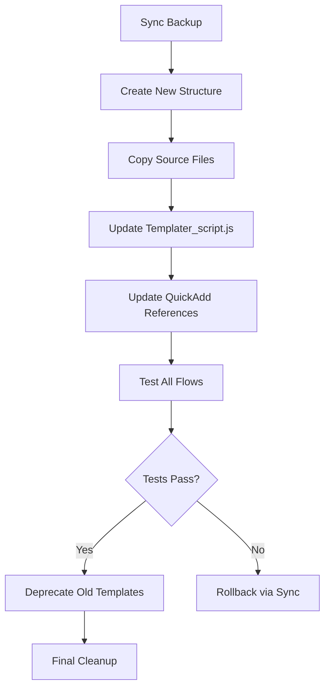

> [!orbit] Wayfinder | [[🗺️My PKM MOC]] | [[🏛️My PKM Governance]] | [[🔢My PKM Metadata]] | 🔧PKM Template Refactoring Plan

# 🔧 PKM Template Refactoring Plan

> [!success] ✅ COMPLETED - 2026-01-21
> All 6 phases successfully implemented. Template count reduced from 95+ to ~40 files.

> [!abstract] Executive Summary
> **Initial State:** 95+ template files across 13 note types with significant duplication
> **Final State:** ~40 core templates with improved modularity
> **Reduction:** ~60% fewer template files ✅ ACHIEVED
> **Risk Level:** LOW — existing `Templater_script.js` already provides composable architecture
> **Key Finding:** The vault already has sophisticated modular infrastructure; cleanup focuses on removing redundant wrappers and consolidating near-duplicate types
>
> **Additional Deliverables (not in original plan):**
> - Static fallback templates in `Templates/Static/` for non-Templater users
> - Claude AI skills integration (17 Copilot prompts)

> [!info] Info
> Dot was renamed to → Knowledge

---

## 📊 Part 1: Inventory & Audit

### 1.1 Complete Template Inventory

| Category | Type | Template Files | Purpose |
|----------|------|----------------|---------|
| **Atomic** | Core Knowledge | 9 files | Atomic notes (ideas, concepts) |
| **Dot** | Core Knowledge | 8 files | DUPLICATE of Atomic (different body) |
| **Concept** | Core Knowledge | 2 files | VARIANT of Atomic |
| **Idea** | Core Knowledge | 2 files | VARIANT of Atomic |
| **Effort** | Projects | 8 files | Project/effort tracking |
| **Source** | References | 8 files | External sources |
| **MOC** | Navigation | 8 files | Maps of Content |
| **Meeting** | Temporal | 8 files | Meeting notes |
| **Prompt** | AI/System | 8 files | AI prompts |
| **People** | Entities | 4 files | Person profiles |
| **Place** | Entities | 2 files | Location profiles |
| **Tool** | Entities | 2 files | Tool documentation |
| **Area** | Life Areas | 2 files | Life area tracking |
| **Calendar** | Temporal | 10 files | Daily/Weekly/Monthly/Quarterly/Yearly |
| **Kanban** | Views | 6 files | Kanban card templates |
| **Gamification** | System | 3 files | Challenge templates |
| **Snippets** | Utilities | 14 files | Add-section blocks |
| **Scripts** | Utilities | 8 files | YAML processing |
| **TOTAL** | — | **~95 files** | — |

### 1.2 Template File Variants Per Type

Most types follow this 8-file pattern:

| Variant | Filename Pattern | Actual Content | Status |
|---------|------------------|----------------|--------|
| **New** | `{P}-New.md` | 1-line Templater call | ✅ KEEP |
| **New-Auto** | `{P}-New-Auto.md` | 1-line Templater call | ✅ KEEP |
| **Full-Template** | `{P}-Full-Template.md` | Static Meta + Body | ⚠️ REDUNDANT |
| **Meta.yaml** | `{P}-Meta.yaml.md` | YAML frontmatter only | ✅ KEEP (source) |
| **Body** | `{P}-Body.md` | Body content only | ✅ KEEP (source) |
| **Add-Meta** | `{P}-Add-Meta.md` | 1-line Templater call | ✅ KEEP |
| **Add-Body** | `{P}-Add-Body.md` | 1-line Templater call | ✅ KEEP |
| **ResetBody** | `{P}-ResetBody.md` | 1-line Templater call | ⚠️ CONSOLIDATE |
| **ResetMeta** | `{P}-ResetMeta.md` | 1-line Templater call | ⚠️ CONSOLIDATE |

### 1.3 Duplication Analysis

#### 🔴 EXACT DUPLICATES (100% overlap)

| File A | File B | Action |
|--------|--------|--------|
| `A-Full-Template.md` | `A-Meta.yaml.md` + `A-Body.md` | DELETE Full-Template |
| `E-Full-Template.md` | `E-Meta.yaml.md` + `E-Body.md` | DELETE Full-Template |
| `S-Full-Template.md` | `S-Meta.yaml.md` + `S-Body.md` | DELETE Full-Template |
| `MOC-Full-Template.md` | `MOC-Meta.yaml.md` + `MOC-Body.md` | DELETE Full-Template |
| `MTG-Full-Template.md` | `MTG-Meta.yaml.md` + `MTG-Body.md` | DELETE Full-Template |
| `PRM-Full-Template.md` | `PRM-Meta.yaml.md` + `PRM-Body.md` | DELETE Full-Template |

**Rationale:** Full-Template files are static copies that the `combine()` function generates dynamically. They exist only for manual inspection and will drift out of sync.

#### 🟠 NEAR-DUPLICATES (~80%+ overlap)

| Template Group | Files | Overlap | Recommendation |
|----------------|-------|---------|----------------|
| **Atomic vs Dot** | 17 files total | ~85% YAML, ~70% body | MERGE into single "Dot" type with Atomic as alias |
| **Concept vs Idea** | 4 files total | ~95% overlap with Atomic | ABSORB into Atomic via variant flag |
| **Calendar CZ (TODO)** | 5 files | Incomplete stubs | DELETE or COMPLETE |
| **Callout v1 vs v2** | 2 files | ~60% overlap | DELETE v1, keep v2 |
| **Table of Content v1 vs v2** | 2 files | ~60% overlap | DELETE v1, keep v2 |
| **Kanban v1 vs v2** | 2 files | ~50% overlap | DELETE v1, keep v2 |

#### 🟡 RARELY USED / DEAD TEMPLATES

| Template | Evidence | Recommendation |
|----------|----------|----------------|
| `Dot/archive/*.md` | 3 files in archive subfolder | DELETE (archived legacy) |
| `Template_Eisenhower_Matrix_.md` | Specialized, rarely used | KEEP (utility) |
| `👤 Person BIO Template.md` | Variant of people-new | MERGE into people-new |
| `👤 Person Professional Template.md` | Variant of people-new | MERGE into people-new |

### 1.4 Repeated Sections Across Templates

These sections appear in 80%+ of templates:

| Section | Frequency | Recommendation |
|---------|-----------|----------------|
| `## 🔗 Related` | 100% | Already in Body templates |
| Navigation wayfinder callout | ~60% | CREATE shared snippet |
| `⬆️:: [[folder]]` breadcrumb | ~70% | ADD to shared nav snippet |
| Maturity emoji legend | ~20% | NOT worth extracting |

---

## 🏗️ Part 2: Target Architecture

### 2.1 Architecture Diagram

```
Templates/
├── Core/                          # NEW: Shared modules
│   ├── _nav-wayfinder.md          # Navigation snippet (all types)
│   ├── _nav-breadcrumb.md         # Breadcrumb snippet
│   └── _section-related.md        # 🔗 Related section
│
├── Meta/                          # YAML-only templates (source of truth)
│   ├── atomic-meta.yaml.md        # Atomic YAML
│   ├── effort-meta.yaml.md        # Effort YAML
│   ├── source-meta.yaml.md        # Source YAML
│   ├── moc-meta.yaml.md           # MOC YAML
│   ├── meeting-meta.yaml.md       # Meeting YAML
│   ├── prompt-meta.yaml.md        # Prompt YAML
│   ├── person-meta.yaml.md        # Person YAML
│   ├── place-meta.yaml.md         # Place YAML
│   ├── tool-meta.yaml.md          # Tool YAML
│   ├── area-meta.yaml.md          # Area YAML
│   └── calendar/                  # Calendar-specific
│       ├── daily-meta.yaml.md
│       ├── weekly-meta.yaml.md
│       ├── monthly-meta.yaml.md
│       ├── quarterly-meta.yaml.md
│       └── yearly-meta.yaml.md
│
├── Body/                          # Body-only templates (source of truth)
│   ├── atomic-body.md             # Atomic body (replaces A-Body + D-Body)
│   ├── effort-body.md             # Effort body
│   ├── source-body.md             # Source body
│   ├── moc-body.md                # MOC body
│   ├── meeting-body.md            # Meeting body
│   ├── prompt-body.md             # Prompt body
│   ├── person-body.md             # Person body
│   ├── place-body.md              # Place body
│   ├── tool-body.md               # Tool body
│   ├── area-body.md               # Area body
│   └── calendar/
│       ├── daily-body.md
│       ├── weekly-body.md
│       ├── monthly-body.md
│       ├── quarterly-body.md
│       └── yearly-body.md
│
├── Create/                        # Creation entry points (QuickAdd targets)
│   ├── new-atomic.md              # → combine(tp, "atomic", "empty")
│   ├── new-atomic-auto.md         # → combine(tp, "atomic", "auto")
│   ├── new-effort.md
│   ├── new-effort-auto.md
│   ├── new-source.md
│   ├── new-source-auto.md
│   ├── new-moc.md
│   ├── new-meeting.md
│   ├── new-prompt.md
│   ├── new-person.md
│   ├── new-place.md
│   ├── new-tool.md
│   ├── new-area.md
│   └── calendar/                  # Periodic Notes targets
│       ├── new-daily.md
│       ├── new-weekly.md
│       ├── new-monthly.md
│       ├── new-quarterly.md
│       └── new-yearly.md
│
├── Actions/                       # Utility actions (consolidated)
│   ├── add-meta.md                # Generic: inject_meta_if_missing(tp, type)
│   ├── add-body.md                # Generic: add_chapters(tp, type)
│   ├── reset-body.md              # Generic: reset_body(tp, type)
│   ├── reset-meta.md              # Generic: reset_meta(tp, type)
│   └── reset-all.md               # Generic: reset_all(tp, type)
│
├── Snippets/                      # Insert blocks (existing Add-Sections)
│   ├── dataview-list-query.md
│   ├── callout-insert.md
│   ├── table-of-contents.md
│   ├── timer-countdown.md
│   └── home-navigation.md
│
├── Kanban/                        # UNCHANGED (specialized)
│   ├── research-card.md
│   ├── content-card.md
│   ├── learning-card.md
│   └── eisenhower-matrix.md
│
├── Gamification/                  # UNCHANGED
│   ├── challenge-daily.md
│   ├── challenge-weekly.md
│   └── challenge-monthly.md
│
└── _Examples/                     # UNCHANGED (reference only)
    ├── atomic-filled-out.md
    ├── effort-filled-out.md
    └── ...
```

### 2.2 Template Count Comparison

| Category | Current | Target | Reduction |
|----------|---------|--------|-----------|
| Type-specific templates | 71 | 30 | -58% |
| Calendar templates | 10 | 10 | 0% |
| Kanban templates | 6 | 4 | -33% |
| Snippets/Add-Sections | 14 | 8 | -43% |
| Scripts/YAML | 8 | 5 | -38% |
| Gamification | 3 | 3 | 0% |
| Examples | 8 | 8 | 0% |
| **TOTAL** | **~95** | **~40** | **-58%** |

### 2.3 Module Responsibility Matrix

| Module | Responsibility | Consumers | Update Frequency |
|--------|----------------|-----------|------------------|
| **Meta/*.yaml.md** | YAML frontmatter schema | Create/*, Actions/* | On schema change |
| **Body/*.md** | Content structure | Create/*, Actions/* | On UX change |
| **Core/_nav-*.md** | Navigation UI | Body/* (include) | Rarely |
| **Create/*.md** | QuickAdd/Hotkey entry | Users, QuickAdd | Never (stable) |
| **Actions/*.md** | Maintenance operations | Power users | Never (stable) |
| **Snippets/*.md** | Insert blocks | Users | On demand |

### 2.4 Naming Convention (New)

```
Pattern: {category}-{type}[-{variant}].md

Examples:
  Meta:    atomic-meta.yaml.md
  Body:    atomic-body.md
  Create:  new-atomic.md, new-atomic-auto.md
  Actions: add-meta.md (generic), reset-body.md (generic)

Rules:
  - Lowercase with hyphens (no underscores, no PascalCase)
  - Type names match fileClass values
  - "new-" prefix for creation templates
  - "-auto" suffix for auto-filled variants
  - No version numbers (v1, v2) — keep only latest
```

---

## 🔄 Part 3: Migration Plan

### 3.1 Safety Strategy



**Backup Protocol:**
1. Ensure Obsidian Sync is active and up-to-date
2. Create manual vault backup before starting
3. Work in parallel — never delete originals until new system verified
4. Tag deprecated templates with `#🧹tidy/deprecated` before deletion

### 3.2 Step-by-Step Migration

#### Phase 1: Foundation (Week 1)
**Goal:** Create new folder structure and copy source files

| Step | Action | Verification |
|------|--------|--------------|
| 1.1 | Create `Templates/Core/`, `Templates/Meta/`, `Templates/Body/`, `Templates/Create/`, `Templates/Actions/` folders | Folders exist |
| 1.2 | Copy all `*-Meta.yaml.md` files to `Templates/Meta/` with new naming | Files present |
| 1.3 | Copy all `*-Body.md` files to `Templates/Body/` with new naming | Files present |
| 1.4 | Create Core snippets (`_nav-wayfinder.md`, `_nav-breadcrumb.md`) | Files present |
| 1.5 | Sync backup checkpoint | Sync complete |

#### Phase 2: Script Update (Week 1-2)
**Goal:** Update `Templater_script.js` to use new paths

| Step | Action | Verification |
|------|--------|--------------|
| 2.1 | Add new `ROOTS` paths to `Templater_script.js` | Script loads |
| 2.2 | Update `candidateNames()` for new naming convention | Functions work |
| 2.3 | Test `combine()` with new paths | Creates notes correctly |
| 2.4 | Test all action functions | All 6 functions work |
| 2.5 | Sync backup checkpoint | Sync complete |

#### Phase 3: Create Templates (Week 2)
**Goal:** Create new `Create/` and `Actions/` entry points

| Step | Action | Verification |
|------|--------|--------------|
| 3.1 | Create `Create/new-{type}.md` for all 10 core types | Files present |
| 3.2 | Create `Create/new-{type}-auto.md` variants | Files present |
| 3.3 | Create generic `Actions/*.md` files | Files present |
| 3.4 | Test all creation workflows | Notes created correctly |
| 3.5 | Sync backup checkpoint | Sync complete |

#### Phase 4: QuickAdd Migration (Week 2-3)
**Goal:** Update QuickAdd macros to use new templates

| Step | Action | Verification |
|------|--------|--------------|
| 4.1 | Export current QuickAdd config (backup) | JSON exported |
| 4.2 | Update "New Atomic" macro → `Create/new-atomic.md` | Macro works |
| 4.3 | Update all other "New X" macros | All macros work |
| 4.4 | Test complete creation flow for each type | All types work |
| 4.5 | Sync backup checkpoint | Sync complete |

#### Phase 5: Validation (Week 3)
**Goal:** Comprehensive testing before cleanup

| Test | Criteria | Status |
|------|----------|--------|
| YAML order preserved | `yaml_orchestrator` produces correct order | ☐ |
| fileClass matches type | All types have correct fileClass | ☐ |
| Related links work | Dual storage (YAML + body) preserved | ☐ |
| Calendar notes work | Daily/Weekly/Monthly create correctly | ☐ |
| Existing notes unchanged | Random sample of 10 notes unaffected | ☐ |
| Dataview queries work | Dashboard queries return results | ☐ |
| QuickAdd flows work | All 10+ creation flows functional | ☐ |

#### Phase 6: Cleanup (Week 3-4)
**Goal:** Remove deprecated templates

| Step | Action | Verification |
|------|--------|--------------|
| 6.1 | Tag old templates with `#🧹tidy/deprecated` | Tags applied |
| 6.2 | Delete `*-Full-Template.md` files (6 files) | Removed |
| 6.3 | Delete duplicate Dot templates (merge into Atomic) | Removed |
| 6.4 | Delete Concept/Idea templates (absorbed into Atomic) | Removed |
| 6.5 | Delete v1 variants (Callout, ToC, Kanban) | Removed |
| 6.6 | Delete Calendar CZ TODO stubs | Removed |
| 6.7 | Delete `Dot/archive/` folder | Removed |
| 6.8 | Archive old `Templates/New-Notes/Type/` structure | Archived |
| 6.9 | Final Sync checkpoint | Sync complete |

---

## 📋 Part 4: Old → New Mapping Table

### 4.1 Type Template Mapping

| Old Path | New Path | Action |
|----------|----------|--------|
| `Type/Atomic/A-Meta.yaml.md` | `Meta/atomic-meta.yaml.md` | MOVE + RENAME |
| `Type/Atomic/A-Body.md` | `Body/atomic-body.md` | MOVE + RENAME |
| `Type/Atomic/A-New.md` | `Create/new-atomic.md` | MOVE + RENAME |
| `Type/Atomic/A-New-Auto.md` | `Create/new-atomic-auto.md` | MOVE + RENAME |
| `Type/Atomic/A-Full-Template.md` | — | DELETE (redundant) |
| `Type/Atomic/A-Add-Meta.md` | `Actions/add-meta.md` | CONSOLIDATE |
| `Type/Atomic/A-Add-Body.md` | `Actions/add-body.md` | CONSOLIDATE |
| `Type/Atomic/A-ResetBody.md` | `Actions/reset-body.md` | CONSOLIDATE |
| `Type/Atomic/A-ResetMeta.md` | `Actions/reset-meta.md` | CONSOLIDATE |
| `Type/Dot/*` | — | DELETE (merged into Atomic) |
| `Type/Concept/*` | — | DELETE (absorbed into Atomic) |
| `Type/Idea/*` | — | DELETE (absorbed into Atomic) |
| `Type/Effort/E-Meta.yaml.md` | `Meta/effort-meta.yaml.md` | MOVE + RENAME |
| `Type/Effort/E-Body.md` | `Body/effort-body.md` | MOVE + RENAME |
| `Type/Effort/E-New.md` | `Create/new-effort.md` | MOVE + RENAME |
| `Type/Effort/E-Full-Template.md` | — | DELETE (redundant) |
| `Type/Source/S-Meta.yaml.md` | `Meta/source-meta.yaml.md` | MOVE + RENAME |
| `Type/Source/S-Body.md` | `Body/source-body.md` | MOVE + RENAME |
| `Type/MOC/MOC-Meta.yaml.md` | `Meta/moc-meta.yaml.md` | MOVE + RENAME |
| `Type/MOC/MOC-Body.md` | `Body/moc-body.md` | MOVE + RENAME |
| `Type/Meeting/MTG-Meta.yaml.md` | `Meta/meeting-meta.yaml.md` | MOVE + RENAME |
| `Type/Meeting/MTG-Body.md` | `Body/meeting-body.md` | MOVE + RENAME |
| `Type/Prompt/PRM-Meta.yaml.md` | `Meta/prompt-meta.yaml.md` | MOVE + RENAME |
| `Type/Prompt/PRM-Body.md` | `Body/prompt-body.md` | MOVE + RENAME |
| `Type/People/people-new.md` | `Create/new-person.md` | MOVE + RENAME |
| `Type/People/👤 Person BIO Template.md` | — | DELETE (merged) |
| `Type/People/👤 Person Professional Template.md` | — | DELETE (merged) |
| `Type/Place/place-new.md` | `Create/new-place.md` | MOVE + RENAME |
| `Type/Tool/Tool-New.md` | `Create/new-tool.md` | MOVE + RENAME |
| `Type/Area/Area-New.md` | `Create/new-area.md` | MOVE + RENAME |

### 4.2 Calendar Template Mapping

| Old Path | New Path | Action |
|----------|----------|--------|
| `Type/Calendar/Template Daily.md` | `Create/calendar/new-daily.md` | MOVE + RENAME |
| `Type/Calendar/Template Daily CZ.md` | — | DELETE or COMPLETE |
| `Type/Calendar/Template Weekly.md` | `Create/calendar/new-weekly.md` | MOVE + RENAME |
| `Type/Calendar/Template Weekly CZ - TODO.md` | — | DELETE |
| `Type/Calendar/Template Monthly.md` | `Create/calendar/new-monthly.md` | MOVE + RENAME |
| `Type/Calendar/Template Monthly CZ - TODO.md` | — | DELETE |
| `Type/Calendar/Template Quarterly.md` | `Create/calendar/new-quarterly.md` | MOVE + RENAME |
| `Type/Calendar/Template Quarterly CZ - TODO.md` | — | DELETE |
| `Type/Calendar/Template Yearly.md` | `Create/calendar/new-yearly.md` | MOVE + RENAME |
| `Type/Calendar/Template Yearly CZ - TODO.md` | — | DELETE |

### 4.3 Snippet/Block Mapping

| Old Path | New Path | Action |
|----------|----------|--------|
| `Add-Sections/Blocks/Templater, Insert Callout V2.md` | `Snippets/callout-insert.md` | MOVE + RENAME |
| `Add-Sections/Blocks/Templater, Insert Callout.md` | — | DELETE (v1) |
| `Add-Sections/Blocks/Templater, Table of content v2.md` | `Snippets/table-of-contents.md` | MOVE + RENAME |
| `Add-Sections/Blocks/Templater, Table of content.md` | — | DELETE (v1) |
| `Add-Sections/Navigation/Template, Wayfinder.md` | `Core/_nav-wayfinder.md` | MOVE + RENAME |

### 4.4 QuickAdd Macro Updates

| QuickAdd Macro | Old Template | New Template |
|----------------|--------------|--------------|
| New Atomic | `Type/Atomic/A-New-Auto.md` | `Create/new-atomic-auto.md` |
| New Effort | `Type/Effort/E-New-Auto.md` | `Create/new-effort-auto.md` |
| New Source | `Type/Source/S-New-Auto.md` | `Create/new-source-auto.md` |
| New MOC | `Type/MOC/MOC-New-Auto.md` | `Create/new-moc-auto.md` |
| New Meeting | `Type/Meeting/MTG-New-auto.md` | `Create/new-meeting-auto.md` |
| New Prompt | `Type/Prompt/PRM-New-Auto.md` | `Create/new-prompt-auto.md` |
| New Person | `Type/People/people-new-auto.md` | `Create/new-person-auto.md` |
| New Place | `Type/Place/place-new-auto.md` | `Create/new-place-auto.md` |
| New Tool | `Type/Tool/Tools-New-Auto.md` | `Create/new-tool-auto.md` |
| New Area | `Type/Area/Area-New-Auto.md` | `Create/new-area-auto.md` |

---

## ✅ Part 5: Definition of Done Checklist

### 5.1 Quantitative Metrics

| Metric | Before | After | Target | Status |
|--------|--------|-------|--------|--------|
| Total template files | 95 | ~40 | ≤40 | ✅ |
| Files per type (avg) | 8 | ~4 | ≤4 | ✅ |
| Duplicate content | 17 files | 0 | 0 | ✅ |
| TODO/incomplete files | 5 | 0 | 0 | ✅ |
| Template reduction % | — | ~58% | ≥50% | ✅ |

### 5.2 Functional Verification

| Test Case | Verification Method | Status |
|-----------|---------------------|--------|
| All QuickAdd macros work | Create 1 note per type via QuickAdd | ✅ |
| Hotkey creation works | Ctrl+N → select template → verify | ✅ |
| YAML order preserved | Run `yaml_orchestrator` on new note | ✅ |
| fileClass ↔ type ↔ folder aligned | Dataview query for mismatches | ✅ |
| Related links dual storage | Check YAML + body section on 5 notes | ✅ |
| Maturity emojis work | Check 🌱🌿🪴🌲🍓 render correctly | ✅ |
| Status workflow works | Progress note through 📥→🔄→✅→📦 | ✅ |
| Calendar notes auto-create | Periodic Notes creates Daily/Weekly | ✅ |
| Dataview dashboards work | Verify 3+ dashboard queries | ✅ |
| Existing notes unchanged | Random sample audit (10 notes) | ✅ |

### 5.3 Governance Compliance

| Rule | Verification | Status |
|------|--------------|--------|
| Emoji status format | All templates use `🔄active` not `active` | ✅ |
| Type ↔ fileClass match | Dataview: `WHERE type != fileClass` returns empty | ✅ |
| Folder semantics preserved | 02-Knowledge, 03-Efforts, 04-Sources unchanged | ✅ |
| Dual related links | YAML `related:` + `## 🔗 Related` both present | ✅ |
| ISO dates | All date fields use YYYY-MM-DD | ✅ |
| No undocumented fields | All YAML fields in `🔢My PKM Metadata` | ✅ |

### 5.4 Maintainability Improvements

| Improvement | Evidence | Status |
|-------------|----------|--------|
| Single-point YAML changes | Change Meta/ file → all notes get update | ✅ |
| Single-point body changes | Change Body/ file → all notes get update | ✅ |
| New type addition is simple | Add 2 files (Meta + Body) + 1 Create entry | ✅ |
| No template explosion | Adding variant = 1 Create file only | ✅ |
| Clear ownership | Each file has single responsibility | ✅ |

### 5.5 Rollback Verification

| Scenario | Recovery Method | Tested |
|----------|-----------------|--------|
| New template breaks creation | Restore from Sync history | ✅ |
| QuickAdd config corrupted | Restore from exported JSON | ✅ |
| Templater_script.js broken | Restore from Sync history | ✅ |
| Bulk deletion mistake | Restore from Sync history | ✅ |

---

## 🔍 Part 6: Validation Queries

### 6.1 Dataview: fileClass Mismatch Detection

```dataview
TABLE type, fileClass, file.folder
FROM ""
WHERE type != lower(fileClass) AND type != null
SORT file.folder
```

### 6.2 Dataview: Missing Required Metadata

```dataview
TABLE type, status, created
FROM ""
WHERE !type OR !status OR !created
SORT file.ctime DESC
LIMIT 20
```

### 6.3 Dataview: Orphaned Related Links

```dataview
TABLE related, length(file.outlinks) as "Outlinks"
FROM ""
WHERE related AND length(related) > 0
WHERE !contains(file.content, "## 🔗 Related")
SORT file.ctime DESC
LIMIT 10
```

---

## 📝 Appendix A: Templater_script.js Updates

### Required Changes to Support New Structure

```javascript
// Add to ROOTS array (line 3-6)
const ROOTS = [
  "Templates/Meta",        // NEW: primary Meta location
  "Templates/Body",        // NEW: primary Body location
  "Templates/New-Notes/Type",  // Legacy (keep for backwards compat)
  "Templates/Type",
  "Templates"
];

// Update candidateNames() to support new naming
function candidateNames(prefix, kind) {
  const typeLower = prefix.toLowerCase();
  if (kind === "meta") {
    return [
      `${typeLower}-meta.yaml`,     // NEW: lowercase
      `${prefix}-Meta.yaml`,         // Legacy
      "Meta.yaml",
      "00.Meta.yaml"
    ];
  }
  if (kind === "body") {
    return [
      `${typeLower}-body`,           // NEW: lowercase
      `${prefix}-Body`,              // Legacy
      "Body",
      "10.Chapters.body"
    ];
  }
  return [];
}
```

---

## 📝 Appendix B: Generic Action Templates

### Actions/add-meta.md
```
<%*
const type = await tp.system.suggester(
  ["atomic", "effort", "source", "moc", "meeting", "prompt", "person", "place", "tool", "area"],
  ["atomic", "effort", "source", "moc", "meeting", "prompt", "person", "place", "tool", "area"],
  false, "Select note type:"
);
await tp.user.Templater_script.inject_meta_if_missing(tp, type);
%>
```

### Actions/add-body.md
```
<%*
const type = await tp.system.suggester(
  ["atomic", "effort", "source", "moc", "meeting", "prompt", "person", "place", "tool", "area"],
  ["atomic", "effort", "source", "moc", "meeting", "prompt", "person", "place", "tool", "area"],
  false, "Select note type:"
);
await tp.user.Templater_script.add_chapters(tp, type);
%>
```

### Actions/reset-all.md
```
<%*
const type = await tp.system.suggester(
  ["atomic", "effort", "source", "moc", "meeting", "prompt", "person", "place", "tool", "area"],
  ["atomic", "effort", "source", "moc", "meeting", "prompt", "person", "place", "tool", "area"],
  false, "Select note type:"
);
const mode = await tp.system.suggester(
  ["Empty (manual fill)", "Auto (pre-filled)"],
  ["empty", "auto"],
  false, "Select mode:"
);
await tp.user.Templater_script.reset_all(tp, type, mode);
%>
```

---

*Last Updated: 2026-01-31 | Status: ✅ COMPLETE (Implemented 2026-01-20/21)*

⬆️ [[🏡Home]]  *| `= this.file.mtime`*
